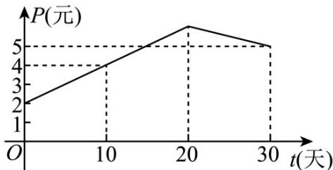

<!-- question-source:start -->
【变式2】某上市股票在 $30$ 天内每股的交易价格 $P$ （元）与时间 $t$ （天）组成有序数对 $\left(t,P\right)$ ，点 $\left(t,P\right)$ 落在如

图所示的两条线段上·该股票在 $^{30}$ 天内（包括 $^{30}$ 天）的日交易量 $^{M}$ （万股）与时间 $^{t}$ （天）的部分数据如下

表所示：

<table><tr><td>第 $t$ 天</td><td>6</td><td>13</td><td>20</td><td>27</td></tr><tr><td> $M$ (万股)</td><td>34</td><td>27</td><td>20</td><td>13</td></tr></table>

(1) 根据提供的图象，写出该股票每股交易价格 $P$ （元）与时间 $t$ （天）所满足的函数关系式 $P =$ \_\_\_\_；

(2) 根据表中数据，写出日交易量 $M$ （万股）与时间 $t$ （天）的一次函数关系式： $M = \_$ ；

(3) 用 $y$ (万元) 表示该股票日交易额，写出 $y$ 关于 $t$ 的函数关系式，并求在这 $^{30}$ 天内第几天日交易额最大，

最大值为多少？
<!-- question-source:end -->

![[高中/课堂同步/题库/人教A版高中数学同步讲义(2026)/01_必修第一册/第四章 指数函数与对数函数/专题4.5 函数的应用（二）（高效培优讲义）/题型10_拟合函数模型的应用问题/questions/answers/Q00075724A1.md]]
