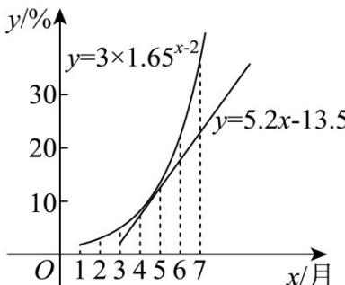

<!-- question-source:start -->
【变式1】滇池是云南省面积最大的高原淡水湖，一段时间曾由于人类活动的加剧，滇池水质恶化，藻类水
华事件频发．在适当的条件下，藻类的生长会进入指数增长阶段．滇池外海北部某年从 $^{1}$ 月到 $^{7}$ 月的水华面
积占比符合指数增长，其模型为 $y=3\times1.65^{x-2}$ ．经研究“以鱼控藻”模式能有效控制藻类水华．如果 $^{3}$ 月开始向
滇池投放一定量的鱼群后，鱼群消耗水华面积占比呈现一次函数 $y=5.2x-13.5$ ，将两函数模型放在同期进行
比较，如图所示．下列说法正确的是（参考数据： $1.65^{6}\approx20.2,1.65^{7}\approx33.3$ ）（）

A. 水华面积占比每月增长率为 1.65
B. 如果不采取有效措施，到 8 月水华的面积占比就会达到 60% 左右
C. “以鱼控藻”模式并没有对水华面积占比减少起到作用
D. 7 月后滇池藻类水华会因“以鱼控藻”模式得到彻底治理
<!-- question-source:end -->

![[高中/课堂同步/题库/人教A版高中数学同步讲义(2026)/01_必修第一册/第四章 指数函数与对数函数/专题4.5 函数的应用（二）（高效培优讲义）/题型9_指数或对数函数模型的应用/questions/answers/Q00075719A1.md]]
