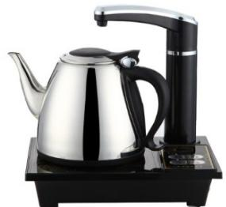

<!-- question-source:start -->
【变式2】为研究一款额定功率是 $1.5\mathrm{kw}$ 、自带水温显示的电动热水壶的加热效果，在壶中水温从加热之初

的室温 $10^{\circ}\mathrm{C}$ 升至 $100^{\circ}\mathrm{C}$ 完全沸腾的过程中，某数学兴趣小组统计了多个关键数值量，包含壶中水量 $a$ （单位：

升）、壶中水温 $x$ （单位： ${}^{\circ}\mathrm{C}$ ）、加热时间 $y$ （单位：秒）·我们选择了其中几个数据记录在如下表格中·

<table><tr><td>水量a(升)</td><td>温度x(°C)</td><td>时间y(秒)</td></tr><tr><td rowspan="3">3</td><td>10</td><td>0</td></tr><tr><td>50</td><td>320</td></tr><tr><td>80</td><td>560</td></tr></table>

(1)根据记录的多组数据，兴趣小组断定 $^{3}$ 升水量的加热时间y是关于壶中水温x的一次函数·试结合表中数据，

计算此函数关系式；并计算在同样室温条件下，将壶中 $^{3}$ 升水从室温烧至沸腾（即 $100^{\circ}C$ ）需要的总时间；

(2)小组通过查阅资料，知道有如下科学论断：

①在同样条件下，将水烧到沸腾所花的时间与壶水量近似满足正比例关系；

②如果把水放在温度为 $\theta_0^\circ\text{C}$ 的空气中冷却，若开始时水的温度是 $\theta_1^\circ\text{C}(\theta_0 < \theta_1)$ 则 $t$ 分钟后水温 $\theta^\circ\text{C}$ 可由公式

$\theta = \theta_0 + (\theta_1 - \theta_0)\mathrm{e}^{-kt}$ 求得，其中， $k = 0.27$ 是由盛水的容器所确定的常量， $\mathrm{e}$ 为自然对数的底数

因为要赶时间，现计划在 $10$ 分钟内完成从水壶通电开始烧水，烧沸腾后立即放入容器，直到水温降到 $50^{\circ}\mathrm{C}$

这一系列过程·根据以上论断，如在水壶中加入 $^{2}$ 升水， $^{10}$ 分钟能完成整个过程吗？如时间够用，请说明理由：

如时间不够用，请建议壶中应加入的水量·

参考数据： $e \approx 2.718$ ， $\ln 1.5 \approx 0.405$ .
<!-- question-source:end -->

![[高中/课堂同步/题库/人教A版高中数学同步讲义(2026)/01_必修第一册/第四章 指数函数与对数函数/专题4.5 函数的应用（二）（高效培优讲义）/题型9_指数或对数函数模型的应用/questions/answers/Q00075720A1.md]]
