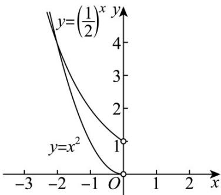

> [!faq]- 《第四章 指数函数与对数函数（高效培优单元测试·强化卷）》官方解析
>
> > [!success]- **【答案】** C
>
> > [!note]- **【解析】**
> > 解：因为 $y = 2^{x}$ 的图象与 $y = \left(\frac{1}{2}\right)^{x}$ 的图象关于 $y$ 轴对称，所以“好点”的个数即方程 $\left(\frac{1}{2}\right)^{x} = x^{2}(x < 0)$ 解的个数，
> >
> > 在同一直角坐标系中，作出函数 $y = \left(\frac{1}{2}\right)^x (x < 0)$ 、 $y = x^2 (x < 0)$ 的图象，
> >
> > 
> >
> > 由图知有两个交点，所以函数 $f(x)$ 有两个“好点”.
> >
> > 故选 **C**
