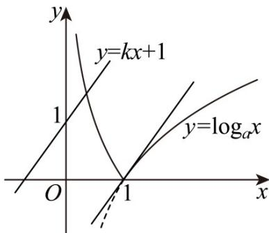
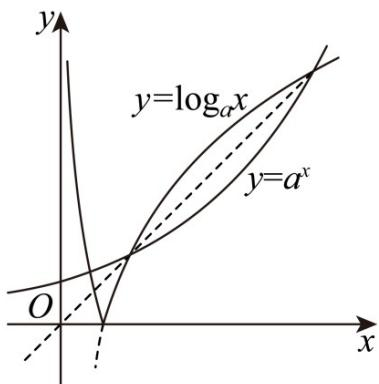

> [!faq]- 《第四章 指数函数与对数函数（高效培优单元测试·强化卷）》官方解析
>
> > [!success]- **【答案】** A. 若 $f(2) = 1$ ，则 $a = \frac{1}{2}$ 或 $a = 2$ B. 若 $0 < m < n$ ，且 $f(m) = f(n)$ ，则 $mn = 1$ C. 存在正数 $k$ ，使得函数 $g(x) = f(x) - kx - 1$ 恰有 1 个零点 D. 不存在实数 $a > 1$ ，使得函数 $g(x) = f(x) - a^x$ 恰有 3 个零点
>
> > [!note]- **【解析】**
> > 对于 A， $f(2)=|\log_{a}2|=1, a>0$ 且 $a\neq1$ ，所以 $a=\frac{1}{2}$ 或 a=2，故 A 正确；
> >
> > 对于 $^{B}$ ，因为函数 $y = \log_a x$ ， $a > 0$ 且 $a \neq 1$ ，为单调函数， $0 < m < n$ ，且 $f(m) = f(n)$
> >
> > 所以 $\log_a m + \log_a n = \log_a mn = 0 \Rightarrow mn = 1$ ，故 B 正确；
> >
> > 对于 $\mathbb{C}$ ，当 $a > 1$ 时，作出函数 $f(x)$ 以及函数 $y = \log_a x$ 在点 $(1,0)$ 处的切线和 $y = kx + 1$ 函数图象如图所示，
> >
> > 
> >
> > 由图可知存在正数 $k$ ，使得函数 $g(x) = f(x) - kx - 1$ 恰有1个零点；故C正确；
> >
> > 对于 D，因为 $y = a^{x}$ 与 $y = \log_{a} x$ 图象关于直线 y = x 对称，如图：
> >
> > 
> >
> > 由图可知当 $y = a^{x}$ 与 $y = \log_{a} x$ 图象均与直线 y = x 相交于两点时， $y = a^{x}$ 图象与函数 $f(x)$ 图象相交于 3 个点，
> > 所以存在实数 a > 1 ，使得函数 $g(x) = f(x) - a^{x}$ 恰有 3 个零点，故 D 错误.
> >
> > 故选：D.
> >
> > 4. “函数 $f(x)$ 满足 $f(a)f(b)<0$ ”是“函数 $f(x)$ 在区间 $(a,b)$ 上有零点”的（）
> >
> > 【答案】
> > A．充分不必要条件 B．必要不充分条件 C．充要条件 D．既不充分也不必要条件
> >
> > 【答案】D
> >
> > 【详解】若函数 $f(x)$ 满足 $f(a)f(b) < 0$
> >
> > 根据零点存在定理，如果函数 $y = f(x)$ 在区间 $[a, b]$ 上的图象是连续不断的一条曲线，
> >
> > 并且有 $f(a)f(b)<0$ ，那么函数 $y=f(x)$ 在区间 $(a,b)$ 内有零点.
> >
> > 但是这里并没有说明函数 $f(x)$ 在区间 $[a,b]$ 上的图象是连续不断的，
> >
> > 比如函数 $f(x)=\left\{\begin{aligned}&\frac{1}{x},x\neq0\\ &0,x=0\end{aligned}\right.$ ，当 $a=-1,\quad b=1$ 时， $f(-1)f(1)=-1\times1=-1<0$
> >
> > 但 $f(x)$ 在 $(-1,1)$ 上没有零点.
> >
> > 所以“函数 $f(x)$ 满足 $f(a)f(b) < 0$ ”不能推出“函数 $f(x)$ 在区间 $(a,b)$ 上有零点”，充分性不成立。
> >
> > 若函数 $f(x)$ 在区间 $(a, b)$ 上有零点，比如函数 $f(x) = x^2$ 在区间 $(-1, 1)$ 上有零点 $x = 0$ ，此时
> >
> > $$
> > f (- 1) f (1) = 1 \times 1 = 1 > 0
> > $$
> >
> > 这说明“函数 $f(x)$ 在区间 $(a,b)$ 上有零点”不能推出“函数 $f(x)$ 满足 $f(a)f(b)<0$ ”，必要性不成立。
> >
> > “函数 $f(x)$ 满足 $f(a)f(b)<0$ ”是“函数 $f(x)$ 在区间 $(a,b)$ 上有零点”的既不充分也不必要条件。
> >
> > 故选：D.
> >
> > 5. 教室通风的目的是通过空气的流动，排出室内的污浊空气和致病微生物，降低室内二氧化碳和致病微
> >
> > 生物的浓度，送进室外的新鲜空气·按照国家标准，教室内空气中二氧化碳最高容许浓度为 $0.15\%$ .经测定，
> >
> > 刚下课时，空气中含有 $0.35\%$ 的二氧化碳，若开窗通风后教室内二氧化碳的浓度为 $y\%$ ，且 $y$ 随时间 $t$ （单
> >
> > 位：分钟）的变化规律可以用函数 $y = 0.05 + \lambda \mathrm{e}^{-\frac{t}{s}}(\lambda, s \in \mathbf{R}, s > 0)$ 描述，又测定，当 $t = 5$ 时，教室内空气中
> >
> > 含有 $0.2\%$ 的二氧化碳，则该教室内从刚下课时的二氧化碳浓度达到国家标准，所需要时间 $t$ （单位：分钟）的最小整数值为（参考数据 $\log_23\approx 1.59$ ， $\log_25\approx 2.32$ ）（ A.6 B.7 C.8 D.9
> >
> > 【答案】C
> >
> > 【详解】由题意可知当 t=0 时， $y=0.35$ ，所以 $0.35=0.05+\lambda$ ，得 $\lambda=0.3$ ，
> > 所以 $y = 0.05 + 0.3 e^{-\frac{t}{s}} (s \in \mathbf{R}, s > 0)$ ,
> >
> > 当 $t = 5$ 时， $y = 0.2$ ，则 $0.2 = 0.05 + 0.3\mathrm{e}^{-\frac{5}{s}}(s \in \mathbf{R}, s > 0)$
> >
> > 所以 $0.15 = 0.3\mathrm{e}^{-\frac{5}{s}}(s \in \mathbf{R}, s > 0)$ ，得 $\mathrm{e}^{-\frac{5}{s}} = 0.5$ ，
> >
> > 所以 $\ln \mathrm{e}^{-\frac{5}{s}} = \ln \frac{1}{2} = -\ln 2, -\frac{5}{s} = -\ln 2, s = \frac{5}{\ln 2}$ 得
> >
> > 所以 $y = 0.05 + 0.3\mathrm{e}^{-\frac{t}{s}} = 0.05 + 0.3\mathrm{e}^{-\frac{t\ln 2}{5}}$
> >
> > 当 $y = 0.15$ 时， $0.15 = 0.05 + 0.3e^{-\frac{t\ln2}{5}}$
> >
> > 得 $\mathrm{e}^{-\frac{t\ln 2}{5}} = \frac{1}{3}$ ，所以 $\ln \mathrm{e}^{-\frac{t\ln 2}{5}} = \ln \frac{1}{3} = -\ln 3$
> >
> > $-\frac{t\ln2}{5}=-\ln3$ ，得 $t=\frac{5\ln3}{\ln2}=5\log_{2}3\approx5\times1.59=7.95$
> >
> > 所以所求时间的最小整数值为 8.
> >
> > 故选 **C**
