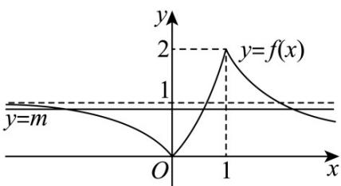

> [!faq]- 《第四章 指数函数与对数函数（高效培优单元测试·强化卷）》官方解析
>
> > [!success]- **【答案】** B
>
> > [!note]- **【解析】**
> > 由题设 $f(x) = \begin{cases} 1 - 3^x, & x \leq 0 \\ 3^x - 1, & 0 < x < 1 \\ \frac{2}{x}, & x = 1 \end{cases}$ ，函数大致图象如下，
> >
> > 
> >
> > 其中当 $x$ 趋近于 $-\infty$ 时， $f(x) \to 1$ ；当 $x$ 趋近于 $+\infty$ 时， $f(x) \to 0$
> >
> > 判断 $y = f(x)$ 的图象与直线 $y = m$ 的交点个数：
> >
> > 由图知， $m\in(0,1)$ 时它们有3个不同的交点，
> >
> > 所以函数 $g(x)=f(x)-m$ 的零点个数为 3.
> >
> > 故选 **B**
