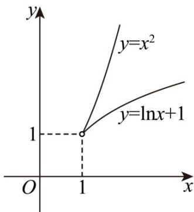

> [!faq]- 《第四章 指数函数与对数函数（高效培优单元测试·强化卷）》官方解析
>
> > [!success]- **【答案】** C
>
> > [!note]- **【解析】**
> > $f(x)=x^{2}$ 在 $\left[1,+\infty\right)$ 上的值域为 $\left[1,+\infty\right)$ .
> > 若对任意 k > M ，存在 $x_{1} < x_{2}$ ，使得 $f(x_{1}) = g(x_{2}) = k$ 成立，
> > 则 $f(x)$ 与 $g(x)$ 在 $\left[1,+\infty\right)$ 上的值域相同，
> > 又 $f(x)=x^{2}$ 在 $\left[1,+\infty\right)$ 上单调递增，则 $f(x_{1})=g(x_{2})<f(x_{2})$ 则对任意 $x\in(1,+\infty)$ ，有 $f(x)>g(x)$ 对于①： $g(x)=x$ 在 $\left[1,+\infty\right)$ 上单调递增且值域为 $\left[1,+\infty\right)$
> >
> > 且 $F(x) = f(x) - g(x) = x^2 -x = x(x - 1) > 0$ 恒成立.
> >
> > 即 $f(x) > g(x)$ 在 $(1, +\infty)$ 上恒成立，符合题意；
> > - **对于②**：，当 $x = 1$ 时， $g(x) = \ln x + 1 - \ln 1 + 1 = 1$ ，即函数 $g(x)$ 在 $[1, +\infty)$ 上的值域为 $[1, +\infty)$
> >
> > 作出函数 $g(x) = \ln x + 1$ 、 $y = f(x)$ 的图象如下图所示：
> >
> > 由图可知，当 $x \in (1, +\infty)$ 时， $f(x)$ 的增长速度显然快于函数 $g(x)$ 的增长速度，
> >
> > 则对任意的 $x \in (1, +\infty)$ ， $f(x) > g(x)$ ，符合题意；
> >
> > 
> > - **对于③**：，函数 $g(x) = 2^{x} - 1$ 在 $[1, +\infty)$ 上递增，且值域为 $[1, +\infty)$ ，
> >
> > 且 $f(5) = 5^2 < 2^5 - 1 = g(5)$ ，不符合题意；
> > - **对于④**：，对于函数 $g(x) = 2 - \frac{1}{x}$ ，该函数在 $[1, +\infty)$ 上为增函数，
> >
> > 且当 $x$ 1时， $0 < \frac{1}{x} \leq 1$ ，则 $g(x) = 2 - \frac{1}{x} \in [1, 2)$ ，不符合题意。
> >
> > 所以，①②是“追逐函数”.
> >
> > 故选：C.
> >
> > 二、选择题：本题共3小题，每小题6分，共18分．在每小题给出的选项中，有多项符合题目要求．全部选对的得6分，部分选对的得部分分，有选错的得0分.
