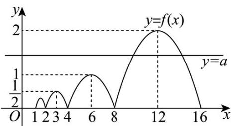

> [!faq]- 《第四章 指数函数与对数函数（高效培优单元测试·强化卷）》官方解析
>
> > [!success]- **【答案】** ABC
>
> > [!note]- **【解析】**
> > A，因为 $\forall x\in[1,+\infty)$ ， $2f(x)=f(2x)$ ，所以 $f(6)=2f(3)=4f\left(\frac{3}{2}\right)$
> >
> > 当 $x \in [1,2)$ 时， $f(x) = -x^2 + 3x - 2$ ，则 $f\left(\frac{3}{2}\right) = -\left(\frac{3}{2}\right)^2 + 3 \times \frac{3}{2} - 2 = \frac{1}{4}$ ，
> >
> > 所以 $f(6)=4\times\frac{1}{4}=1$ ，对；
> >
> > B，由 $x\in [8,12]$ ，则 $\frac{x}{8}\in \left[1,\frac{3}{2}\right)$ ，故 $f(x) = 2^3 f\left(\frac{x}{8}\right) = 8[-\left(\frac{x}{8}\right)^2 +3\times \frac{x}{8} -2] = -\frac{1}{8} x^2 +3x - 16$
> >
> > 其开口向下且对称轴为 $x = -\frac{3}{2 \times \left(-\frac{1}{8}\right)} = 12$ ，所以 $f(x)$ 在 $[8,12]$ 上单调递增，对；
> >
> > C，因为 $2f(x)=f(2x)$ ，函数 $F(x)=f(x)-a$ 的零点从小到大依次记为 $x_{1}, x_{2}, x_{3}, \cdots$
> >
> > 若 $x_{1} + x_{2} = 12$ ，则 $x_{1},x_{2}$ 是 $y = a$ 与 $f(x)$ 在对称轴为 $x = 6$ 对应区间上的交点横坐标，
> >
> > $f(x)$ 在 $[1,2)$ 上 $f(x) = -x^{2} + 3x - 2$ ，则 $x\in [4,8)$ ，则 $f(x) = 2^2 f\left(\frac{x}{4}\right)$
> >
> > 在 $[4,8)$ 上 $f(x) = 4\left[-\left(\frac{x}{4}\right)^2 + 3 \times \frac{x}{4} - 2\right] = -\frac{1}{4} x^2 + 3x - 8$ ，如下图示，
> >
> > 根据 $f(x)$ 与 $y = a$ 的交点情况，可得 $a \in \left(\frac{1}{2}, 1\right)$ ，对；
> >
> > 
> >
> > D，同 C 分析，若 $F(x)=f(x)-a$ 在 $[3,16]$ 上有 4 个零点，由图知 $a\in(\frac{1}{2},1)$ ，错.
> >
> > 故选 **ABC**
