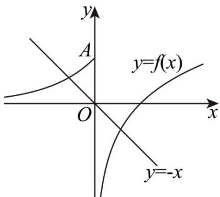

> [!faq]- 《第四章 指数函数与对数函数（高效培优单元测试·强化卷）》官方解析
>
> > [!success]- **【答案】** $2 - \mathrm{e}^{-2}$
>
> > [!note]- **【解析】**
> > 画出函数 $f(x)$ 的图象，再画出直线 $y = -x$ ，
> >
> > 可以发现当直线过点 A 时，直线与函数图象有两个交点，并且向下可以无限移动，都可以保证直线与函数
> >
> > 的图象有两个交点，
> >
> > 即方程 $f(x) = -x - a$ 有两个解，也就是函数 $g(x)$ 有两个零点 $x_{1}, x_{2}$
> >
> > 此时满足 $-a \leq 1$ ，即 a -1。
> >
> > 不妨设 $x_{1} < x_{2}$ ，则 $x_{2} - x_{1} = \mathrm{e}^{-2} + 2$
> >
> > 从而 $\left\{ \begin{array}{l} -x_{1} - a = \mathrm{e}^{x_{1}},\\ -x_{2} - a = \ln x_{2}, \end{array} \right.$ 即 $\left\{ \begin{array}{l} -a = \mathrm{e}^{x_1} + x_1,\\ -a = \ln x_2 + x_2 = \mathrm{e}^{\ln x_2} + \ln x_2, \end{array} \right.$
> >
> > 设 $g(x)=\mathrm{e}^{x}+x$ ， $g(x)$ 函数单调递增，且 $g(x_{1})=g(\ln x_{2})$
> >
> > 所以 $x_{1} = \ln x_{2}, x_{2} = \mathrm{e}^{x_{1}}$ ，又 $x_{2} - x_{1} = \mathrm{e}^{x_{1}} - x_{1} = \mathrm{e}^{-2} + 2$ ，解得 $x_{1} = -2$
> >
> > 所以 $-a = e^{x_{1}} + x_{1} = e^{-2} - 2, a = 2 - e^{-2}$ .
> >
> > 
> >
> > 故答案为： $2-e^{-2}$
