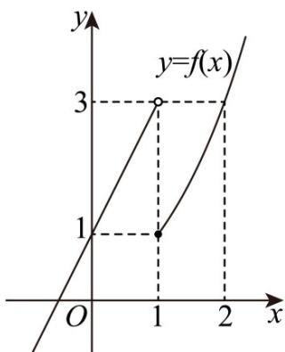

> [!faq]- 《第四章 指数函数与对数函数（高效培优单元测试·强化卷）》官方解析
>
> > [!success]- **【答案】** [0,3)
>
> > [!note]- **【解析】**
> > 作出 $f(x)$ 的图象，如图所示．由 $f(a) = f(b)$ ，得 $2a + 1 = 2^b - 1$ ， $b \in [1,2)$
> >
> > 则 $a = \frac{2^b - 2}{2}$ ， $b\in [1,2)$ ，则 $af(b) = \frac{2^b - 2}{2}\times (2^b -1)$ ， $b\in [1,2)$
> >
> > 令 $t = 2^{b}$ ， $t\in [2,4)$ ，则 $af(b) = \frac{(t - 2)(t - 1)}{2} = \frac{1}{2}\left(t - \frac{3}{2}\right)^{2} - \frac{1}{8}$
> >
> > 当 $t \in [2,4)$ 时，函数 $h(t) = \frac{1}{2}\left(t - \frac{3}{2}\right)^2 - \frac{1}{8}$ 的取值范围是 $[0,3)$ .
> >
> > 故答案为：[0,3)。
> >
> > 
