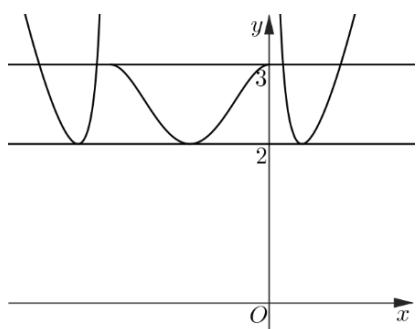

> [!faq]- 《第四章 指数函数与对数函数（高效培优单元测试·强化卷）》官方解析
>
> > [!success]- **【答案】** $(2,3]$
>
> > [!note]- **【解析】**
> > 令 $f(x) > 0$ ，即 $x(x + 2) > 0$ ，解得 $x < -2$ 或 $x > 0$ ，易知 $f(x) \leq 0$ ，可得 $-2 \leq x \leq 0$
> >
> > 可得 $g\left[f(x)\right]=\left\{\begin{aligned}&x^{2}+2x+\frac{1}{x^{2}+2x},&x<-2\\&-\left(x^{2}+2x\right)^{2}+3,-2\leq x\leq0\\&x^{2}+2x+\frac{1}{x^{2}+2x},&x>0\end{aligned}\right.$
> >
> > 当 $-2 \leq x \leq 0$ 时，设 $a \in [-2, -1]$ ，且 $b = g[f(a)] = -(a^2 + 2a)^2 + 3$
> >
> > 点 $\left(a,b\right)$ 关于直线 $x = -1$ 的对称点为 $\left(-2 - a,b\right)$
> >
> > $$
> > g [ f (- 2 - a) ] = - \left[ (- 2 - a) ^ {2} + 2 (- 2 - a) \right] + 3 = - (a ^ {2} + 2 a) + 3 = b
> > $$
> >
> > 当 $x \in (-\infty, -2) \cup (0, +\infty)$ 时，设 $c \in (0, +\infty)$ ，且 $d = g[f(c)] = c^2 + 2c + \frac{1}{c^2 + 2c}$ ，
> >
> > 点 $(c,d)$ 关于直线x=-1的对称点为 $(-2-c,d)$ ，
> >
> > $$
> > g [ f (- 2 - c) ] = (- 2 - c) ^ {2} + 2 (- 2 - c) + \frac {1}{(- 2 - c) ^ {2} + 2 (- 2 - c)} = c ^ {2} + 2 c + \frac {1}{c ^ {2} + 2 c} = d
> > $$
> >
> > 综上所述，函数 $y = g[f(x)]$ 的图象关于直线 x = -1 对称.
> >
> > 当 $x \in [-1, 0]$ 时，由 $f(x) = (x + 1)^2 - 1$ 单调递增， $g(x) = -x^2 + 3$ 单调递增，
> >
> > 则函数 $y = g[f(x)]$ 在 $[-1,0]$ 上单调递增；
> >
> > 当 $x \in (0,1)$ 时，由 $f(x) = (x + 1)^2 - 1$ 单调递增， $g(x) = x + \frac{1}{x}$ 单调递减，
> >
> > 则函数 $y = g[f(x)]$ 在 $(0,1)$ 上单调递减；
> >
> > 当 $x \in (1, +\infty)$ 时，由 $f(x) = (x + 1)^2 - 1$ 单调递增， $g(x) = x + \frac{1}{x}$ 单调递增，
> >
> > 则函数 $y = g[f(x)]$ 在 $(1, +\infty)$ 上单调递增.
> >
> > 当 $x \in [-2, 0]$ 时，由 $g[f(-1)] = 2$ ， $g[f(0)] = 3$ ，则 $g[f(x)] \in [2, 3]$ ；
> >
> > 当 $x \in (-\infty, -2) \cup (0, +\infty)$ 时，由 $g[f(1)] = 2$ ，则 $g[f(x)] \in [2, +\infty)$ .
> >
> > 可得下图：
> >
> > 
> >
> > 由函数 $h(x)$ 的图象可由函数 $y = g[f(x)]$ 的图象平移 $|a|$ 个单位，
> >
> > 则 $a \in (2,3]$ .
> >
> > 故答案为： $(2,3]$ .
> >
> > 四、解答题：本题共5小题，共77分。解答应写出文字说明、证明过程或演算步骤。
