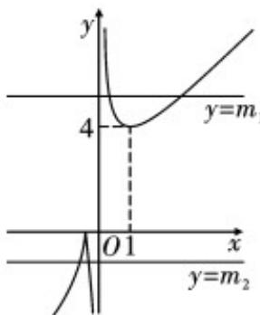

> [!faq]- 《第四章 指数函数与对数函数（高效培优单元测试·提升卷）》官方解析
>
> > [!success]- **【答案】** $(- \infty, 0) \cup (4, + \infty)$
>
> > [!note]- **【解析】**
> > 因 $|f(0)| = 1$ ，则 $^{0}$ 不是 $|f(x)| - mx = 0$ 的解.
> >
> > $x \neq 0$ 时， $|f(x)| - mx = 0 \Leftrightarrow m = \frac{|f(x)|}{x}$ .
> >
> > 令 $g(x)=\frac{|f(x)|}{x},y=m$
> >
> > 依题意函数 $y = g(x)$ 的图象与直线 y = m 有两个公共点.
> >
> > $f(x)$ 0时， $x$ $1 - \sqrt{2},f(x) <   0$ 时， $x <   1 - \sqrt{2}$
> >
> > 于是得 $g(x) = \begin{cases} x + \frac{1}{x} + 2, & x > 0 \\ -x + \frac{1}{x} + 2, & 1 - \sqrt{2} \leq x < 0 \\ x - \frac{1}{x} - 2, & x < 1 - \sqrt{2} \end{cases}$
> >
> > 由对勾函数知， $g(x)$ 在 $(0,1)$ 上递减，在 $(1,+\infty)$ 上递增，且 $g(1)=4$ 又 $g(x)$ 在 $[1-\sqrt{2},0)$ 上递减，在 $(-\infty,1-\sqrt{2}]$ 上递增，且 $g(1-\sqrt{2})=0$
> >
> > 如图：
> >
> > 
> >
> > 直线 $y = m_{1}$ 与 $y = g(x)$ 的图象有两个公共点， $m_{1} > 4$
> >
> > 直线 $y = m_{2}$ 与 $y = g(x)$ 的图象有两个公共点， $m_{2} < 0$
> >
> > 从而得函数 $y = g(x)$ 的图象与直线 y = m 有两个公共点时 m < 0 或 m > 4
> >
> > 所以实数 m 的取值范围是 $(-∞,0)∪(4,+∞)$ .
> >
> > 故答案为： $(- \infty, 0) \cup (4, + \infty)$
> >
> > 13. 如果一个函数的定义域与值域均为 $\left[m, n\right]$ ，则称该函数为 $\left[m, n\right]$ 上的同域函数， $\left[m, n\right]$ 称为同域区间。已知函数 $f(x) = \sqrt{ax}^2 - 2\sqrt{ax} + b + 1$ 为区间 $[1, 3]$ 上的同域函数。
> >
> > (1) 函数 $f(x)$ 的解析式是 \_\_\_\_；
> >
> > (2) 若函数 $g(x)=k-\sqrt{\frac{1}{2}x^{2}-x}(k-0)$ 在 $x\leq0$ 时存在同域区间，则实数 k 的取值范围是 \_\_\_\_。
> >
> > 【答案】 $f(x) = \frac{1}{2} x^2 -x + \frac{3}{2}$ $\left[0,1 - \frac{\sqrt{2}}{2}\right)$
> >
> > 【详解】 $^{1}$ ）由 $f(x)=\sqrt{ax^{2}}-2\sqrt{ax}+b+1=\sqrt{a}(x-1)^{2}-\sqrt{a}+b+1$ ，所以函数 $f(x)=\sqrt{ax^{2}}-2\sqrt{ax}+b+1$ 在
> >
> > 上单调递增，又函数是同域函数，得 $\left\{ \begin{array}{l} f(1) = 1, \text{即} \\ f(3) = 3, \end{array} \right.$ 解得 $\left\{ \begin{array}{l} a = \frac{1}{4}, \\ b = \frac{1}{2}, \end{array} \right.$ 所以 $f(x) = \frac{1}{2} x^2 - x + \frac{3}{2}$ .
> >
> > (2) 由 (1) 得 $g(x) = k - \sqrt{\frac{1}{2} x^2 - x} = k - \sqrt{\frac{1}{2} (x - 1)^2 - \frac{1}{2}} \left( k \quad 0 \right)$ ，所以 $g(x)$ 在 $(- \infty, 0]$ 上单调递增，设 $[c, d]$
> >
> > 是函数 的同域区间，得 $\left\{\begin{aligned}g(c)&=c,\\ g(d)&=d,\end{aligned}\right.$ 即 $\left\{\begin{aligned}k-\sqrt{\frac{1}{2}c^{2}-c}&=c,\\ k-\sqrt{\frac{1}{2}d^{2}-d}&=d,\end{aligned}\right.$ 得 在 上的根为
> >
> > 和，则满足 $\left\{ \begin{array}{ll}\Delta = [2(2k - 1)]^2 -4\times 2k^2 >0,\\ c + d = 2(2k - 1) <   0,\\ c\cdot d = 2k^2\quad 0,\\ k\quad 0, \end{array} \right.$ 即 $\left\{ \begin{array}{ll}k > 1 + \frac{\sqrt{2}}{2}\text{或} k <   1 - \frac{\sqrt{2}}{2},\\ k <   \frac{1}{2},\\ k\quad 0, \end{array} \right.$
> >
> > 解得 $0 \leq k < 1 - \frac{\sqrt{2}}{2}$
