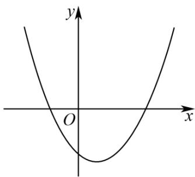
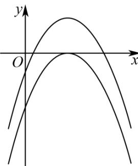

> [!faq]- 《第四章 指数函数与对数函数（高效培优讲义）》官方解析
>
> > [!success]- **【答案】** $\left[-\frac{1}{4}, + \infty\right)$
>
> > [!note]- **【解析】**
> > 若 m=0 ，则由 $f(x)=x-1=0$ ，得 x=1 ，满足要求。
> >
> > 若 $m \neq 0$ ，因为 $f(0) = -1 < 0$
> >
> > 若 $f(x)$ 的图象与 $x$ 轴的交点只有一个在原点的右侧，则
> >
> > $\left\{ \begin{array}{l} \Delta = 1 + 4m > 0, \\ m > 0, \quad \text{解得} m > 0; \end{array} \right.$
> >
> > 
> >
> > 若 $f(x)$ 的图象与 $x$ 轴的两个交点都在原点的右侧，则
> >
> > $\left\{ \begin{array}{l} \Delta = 1 + 4m \quad 0, \\ -\frac{1}{2m} > 0, \\ m < 0, \end{array} \right.$ 解得 $-\frac{1}{4} \leq m < 0$
> >
> > 
> >
> > 综上，实数 $m$ 的取值范围是 $\left[-\frac{1}{4}, +\infty\right)$
> >
> > 故答案为： $\left[-\frac{1}{4},+\infty\right)$ .
