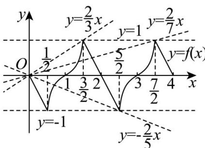

> [!faq]- 《第四章 指数函数与对数函数（高效培优讲义）》官方解析
>
> > [!success]- **【答案】** (1)存在，m=2,n=1 (2)证明见解析 $$ \left\{- \frac {2}{5} \right\} \cup \left(\frac {2}{7}, \frac {2}{3}\right) \tag {3} $$
>
> > [!note]- **【解析】**
> > （1）函数 $y = 2x - 3$ 具有“ $m^{*}n$ 性质”.
> >
> > 因为 $f(1 - x) + mf(x + 1) = nf(x)$ ，且 $f(x) = 2x - 3$
> >
> > 所以 $2(1 - x) - 3 + m[2(x + 1) - 3] = n(2x - 3)$ ，整理得 $2(m - n - 1) \cdot x - (m - 3n + 1) = 0$
> >
> > 若函数 $y = 2x - 3$ 具有“ $m^{*}n$ 性质”，则可得 $\left\{ \begin{array}{l} 2(m - n - 1) = 0 \\ -(m - 3n + 1) = 0 \end{array} \right.$ 解得 $\left\{ \begin{array}{l} m = 2, \\ n = 1, \end{array} \right.$
> >
> > 所以函数 $y = 2x - 3$ 具有“ $m^{*}n$ 性质”，此时 $m = 2, n = 1$
> >
> > (2) 假设函数 $y = \log_{a} x$ (a > 0 且 $a \neq 1$ ) 具有“ $m^{*} n$ 性质”，
> >
> > 则 $\log_a(1 - x) + m\log_a(x + 1) = n\log_a x$ ，则 $\left\{ \begin{array}{l} 1 - x > 0 \\ 1 + x > 0 \\ x > 0 \end{array} \right.$ 解得 $0 < x < 1$
> >
> > 整理得 $\log_a\left[\left(1 - x\right)(x + 1)^m\right] = \log_a x^n$ ，则 $\left(1 - x\right)(x + 1)^m = x^n$
> >
> > 分别取 $x = \frac{1}{4},\frac{1}{2}$ ，可得 $\left\{ \begin{array}{ll}\frac{3}{4} (\frac{5}{4})^m = (\frac{1}{4})^n\\ \frac{1}{2} (\frac{3}{2})^m = (\frac{1}{2})^n \end{array} \right.$ 解得 $m = \log_{\frac{9}{5}}3$
> >
> > 分别取 $x = \frac{1}{9},\frac{1}{3}$ ，可得 $\left\{ \begin{array}{ll}\frac{8}{9} (\frac{10}{9})^m = (\frac{1}{9})^n\\ \frac{2}{3} (\frac{4}{3})^m = (\frac{1}{3})^n \end{array} \right.$ 解得 $m = \log_{\frac{8}{5}}2$
> >
> > 显然 $\frac{\log_93\neq\log_82}{5}$ ，即对任意 $x\in(0,1)$ ，不存在实数 $m,n$ 使得 $(1-x)(x+1)^{m}=x^{n}$ 恒成立，
> >
> > 所以假设不成立，函数 $y = \log_a x$ （ $a > 0$ 且 $a \neq 1$ ）不具有“ $m^* n$ 性质”.
> >
> > (3) $y = f(x)$ 具有“1\*0 性质”，则 $f(1 - x) + f(x + 1) = 0$ ，可知 $y = f(x)$ 的图象关于点 $(1,0)$ 对称，可得 $f(-x) + f(x + 2) = 0$ ，即 $f(x + 2) = -f(-x)$ ，
> >
> > 又因为 $y = f(x)$ 是定义域为 R 的奇函数，则 $f(x) = -f(-x)$
> >
> > 可得 $f(x+2)=f(x)$ ，即函数 $f(x)$ 的周期为 2。
> >
> > 令 $y = f(x) - tx = 0$ ，则 $f(x) = tx$
> >
> > 由题意可得， $y = f(x)$ 的图象与直线 $y = tx$ 在 $[-4, 4]$ 内有5个不同的交点，
> >
> > 又 $y = tx$ 为奇函数， $\left(0,0\right)$ 为 $y = f(x)$ 的图象与直线 $y = tx$ 的一个交点，
> >
> > 所以由图象的对称性可知， $y = f(x)$ 的图象与直线 $y = tx$ 在 $(0,4]$ 内有2个不同的交点.
> >
> > 作出 $f(x)$ 在 $[0,4]$ 内的图象（如图），
> >
> > 
> >
> > 当直线 $y = tx$ 过 $\left(\frac{3}{2}, 1\right)$ 时，可得 $t = \frac{2}{3}$ ；直线 $y = tx$ 过 $\left(\frac{5}{2}, -1\right)$ 时，可得 $t = -\frac{2}{5}$ ；当直线 $y = tx$ 过 $\left(\frac{7}{2}, 1\right)$ 时，可得 $t = \frac{2}{7}$ .
> >
> > 结合图象可知，实数 $t$ 的取值范围为 $\left\{-\frac{2}{5}\right\} \cup \left(\frac{2}{7},\frac{2}{3}\right)$
