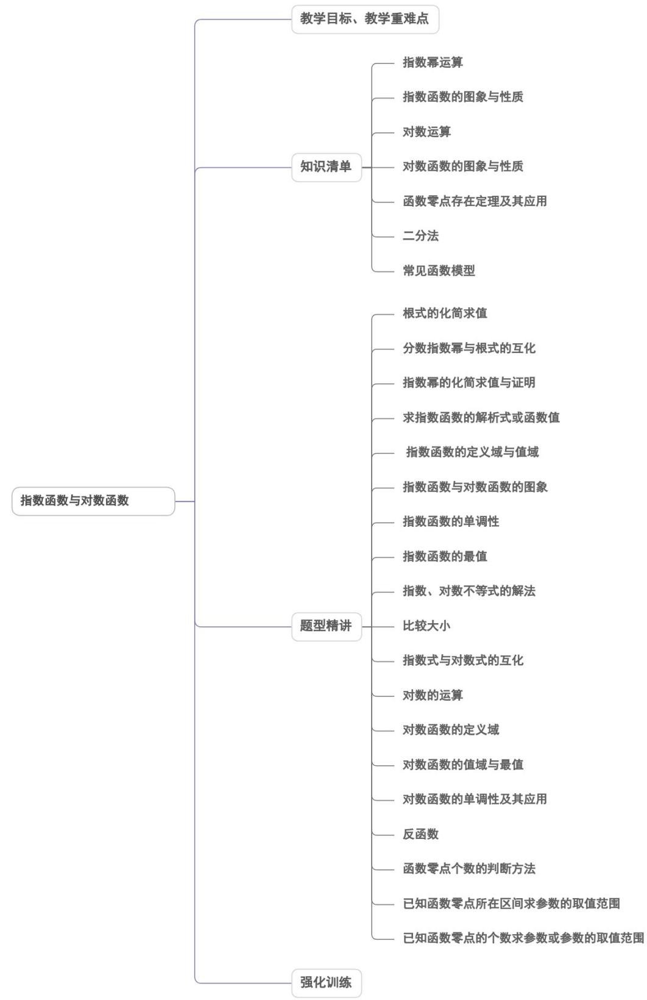
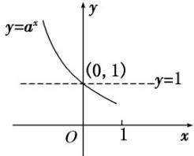
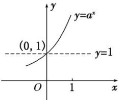
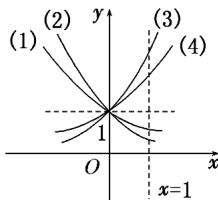
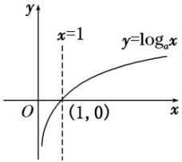
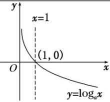
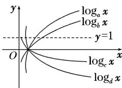

<!-- source-part:1 pages:1-50 -->

## 第四章 指数函数与对数函数

内容概览

<table><tr><td>教学目标</td><td>1.掌握指数函数、对数函数的概念、图象和性质,并能用图象和性质解决有关问题.2.了解指数函数 $y=a^{x}(a>0$ ,且 $a\neq1)$ 与对数函数 $y=\log_{a}x(a>0$ ,且 $a\neq1)$ 互为反函数,通过对几类基本初等函数的变化差异进行比较,来解决简单的实际问题.3.掌握运用函数性质求方程近似解的基本方法(二分法);理解用函数构建数学模型的基本过程;运用模型思想发现和提出、分析和解决问题.</td></tr><tr><td>教学重难点</td><td>1、重点指数函数、对数函数的图象与性质及其应用,特别是单调性的应用.2、难点与指数、对数函数有关的函数值域和复合函数的单调性问题和选择恰当的函数模型解决实际问题.</td></tr></table>

## 知识清单

## 知识点 01 指数幂运算

## 1. 根式

## (1)根式的概念

若 $x^n = a$ ，则 $x$ 叫做 $a$ 的 $n$ 次方根，其中 $n > 1$ 且 $n \in \mathbb{N}^*$ . 式子叫做根式，这里 $n$ 叫做根指数， $a$ 叫做被开方数. (2) $a$ 的 $n$ 次方根的表示

$$
x ^ {n} = a \Rightarrow
$$

## 2. 有理数指数幂

<table><tr><td rowspan="3">幂的有关概念</td><td>正分数指数幂: $a^{\frac{m}{n}} = (a > 0, m, n \in \mathbb{N}^{*}, \text{且 } n > 1)$ </td></tr><tr><td>负分数指数幂: $a^{-\frac{m}{n}} = ^{\frac{m}{n}} = (a > 0, m, n \in \mathbb{N}^{*}, \text{且 } n > 1)$ </td></tr><tr><td>0 的正分数指数幂等于 0 , 0 的负分数指数幂无意义</td></tr><tr><td>有理数指数幂的性质</td><td> $a^{r}a^{s} = a^{r+s}(a > 0, r, s \in \mathbb{Q})$ </td></tr><tr><td rowspan="2"></td><td> $(a^r)^s = a^{rs}(a > 0, r, s \in \mathbf{Q})$ </td></tr><tr><td> $(ab)^r = a^rb^r(a > 0, b > 0, r \in \mathbf{Q})$ </td></tr></table>

【即学即练】

1. 已知 $a, b \in \mathbb{R}$ ，且 $3a + b = 4$ ，则 $8^a + 2^b$ 的最小值是（）A.2 B. $2\sqrt{2}$ C.4 D.8

【答案】D

【详解】因为 $3a + b = 4$

所以 $8^{a} + 2^{b} = 2^{3a} + 2^{b}$ $2\sqrt{2^{3a} \cdot 2^{b}} = 2\sqrt{2^{3a + b}} = 2\sqrt{2^{4}} = 8$ ，当且仅当 $2^{3a} = 2^{b}$ 即 $3a = b = 2$ 时等号成立，故选：D.

2. 已知幂函数 $f(x) = x^a, g(x) = x^b (a, b \in \mathbf{R})$ 的图象分别经过 $M\left(\frac{1}{3}, \frac{2}{3}\right), N\left(\frac{2}{3}, \frac{1}{3}\right)$ 两点，则（）A. $a + b = 1$ B. $ab = 1$ C. $a - b = 1$ D. $a = b$

【答案】B

【详解】因为幂函数 $f(x) = x^{a}, g(x) = x^{b} (a, b \in \mathbf{R})$ 的图象分别经过 $M\left(\frac{1}{3}, \frac{2}{3}\right), N\left(\frac{2}{3}, \frac{1}{3}\right)$ 两点，所以把 $M\left(\frac{1}{3}, \frac{2}{3}\right), N\left(\frac{2}{3}, \frac{1}{3}\right)$ 两点分别代入 $f(x) = x^{a}, g(x) = x^{b}$ 可得 $\frac{2}{3} = \left(\frac{1}{3}\right)^{a}, \frac{1}{3} = \left(\frac{2}{3}\right)^{b}$ ，故 $\left(\frac{1}{3}\right)^{ab} = \left[\left(\frac{1}{3}\right)^{a}\right]^{b} = \left(\frac{2}{3}\right)^{b} = \frac{1}{3}$ ，故 $ab = 1$ 。

故选：B.

## 知识点 02 指数函数的图象与性质

## 1. 指数函数的图象

<table><tr><td rowspan="2">函数</td><td colspan="2"> $y = a^{x}(a > 0$ ,且  $a \neq 1)$ </td></tr><tr><td> $0 < a < 1$ </td><td> $a > 1$ </td></tr><tr><td>图象</td><td></td><td></td></tr><tr><td rowspan="2">图象特征</td><td colspan="2">在  $x$  轴上方,过定点(0,1)</td></tr><tr><td>当  $x$  逐渐增大时,图象逐渐下降</td><td>当  $x$  逐渐增大时,图象逐渐上升</td></tr></table>

2.指数函数图象画法的三个关键点

画指数函数 $y = a^{x}(a > 0$ ，且 $a \neq 1)$ 的图象，应抓住三个关键点：(1, a)，(0,1)，.

3. 指数函数的图象与底数大小的比较

如图是指数函数(1) $y=a^{x}$ ，(2) $y=b^{x}$ ，(3) $y=c^{x}$ ，(4) $y=d^{x}$ 的图象，底数a，b，c，d与1之间的大小关系为 $c>d>1>a>b$ .

由此我们可得到以下规律：在 $y$ 轴右(左)侧图象越高(低)，其底数越大.

## 4、指数函数的性质

<table><tr><td colspan="2" rowspan="2">函数</td><td colspan="2"> $y = a^{x} (a > 0$ ,且  $a \neq 1)$ </td></tr><tr><td> $0 < a < 1$ </td><td> $a > 1$ </td></tr><tr><td rowspan="4">性质</td><td>定义域</td><td colspan="2">R</td></tr><tr><td>值域</td><td colspan="2"> $(0, +\infty)$ </td></tr><tr><td>单调性</td><td>在 R 上是减函数</td><td>在 R 上是增函数</td></tr><tr><td>函数值变化规律</td><td colspan="2">当  $x = 0$  时, $y = 1$ </td></tr><tr><td></td><td></td><td colspan="2">当x&lt;0时,y&gt;1;当x&gt;0时,0当x&lt;0时,0;当x&gt;0时,y&gt;1</td></tr></table>

## 【即学即练】

1. 设 $f(x) = \frac{3^x}{1 + 3^x}$ ， $[x]$ 表示不超过实数 $x$ 的最大整数，则函数 $\left[f(x) - \frac{1}{2}\right] + \left[f(-x) - \frac{1}{2}\right]$ 的值域是（）.

【答案】

A. $\{-1,0,1\}$ B. $\{-1,0\}$ C. $[-1,1]$ D. $[-1,0]$

【答案】B

【详解】由题意得 $f(x) = \frac{3^x}{1 + 3^x} = 1 - \frac{1}{1 + 3^x}, f(-x) = \frac{3^{-x}}{1 + 3^{-x}} = \frac{1}{1 + 3^x}$

①当 $x > 0$ 时， $3^{x} > 1$ ，此时 $\frac{1}{2} < f(x) < 1$ ， $0 < f(-x) < \frac{1}{2}$ ，

则 $0 < f(x) - \frac{1}{2} < \frac{1}{2}, -\frac{1}{2} < f(-x) - \frac{1}{2} < 0$

从而 $\left[f(x) - \frac{1}{2}\right] = 0$ ， $\left[f(-x) - \frac{1}{2}\right] = -1$

所以 $\left[f(x) - \frac{1}{2}\right] + \left[f(-x) - \frac{1}{2}\right] = -1$

②当 $x = 0$ 时， $f(x) = \frac{1}{2}$ ， $f(-x) = \frac{1}{2}$

$f(x) - \frac{1}{2} = 0$ ， $f(-x) - \frac{1}{2} = 0$ ， $\left[f(x) - \frac{1}{2}\right] = 0$ ， $\left[f(-x) - \frac{1}{2}\right] = 0$

故 $\left[f(x) - \frac{1}{2}\right] + \left[f(-x) - \frac{1}{2}\right] = 0$

③当 $x < 0$ 时， $0 < 3^x < 1$ ，此时 $0 < f(x) < \frac{1}{2}$ ， $\frac{1}{2} < f(-x) < 1$ ，

则 $-\frac{1}{2} < f(x) - \frac{1}{2} < 0$ ， $0 < f(-x) - \frac{1}{2} < \frac{1}{2}$

从而 $\left[f(x) - \frac{1}{2}\right] = -1$ ， $\left[f(-x) - \frac{1}{2}\right] = 0$

所以 $\left[f(x) - \frac{1}{2}\right] + \left[f(-x) - \frac{1}{2}\right] = -1$

综上所述， $\left[f(x) - \frac{1}{2}\right] + \left[f(-x) - \frac{1}{2}\right]$ 的值域为 $\{0, - 1\}$

故选：B.

2. 已知 $x, y \in \mathbf{R}$ ，则“ $5^x > 5^y$ ”是“ $x^4 > y^4$ ”的（）A．充分不必要条件 B．必要不充分条件C．充要条件 D．既不充分也不必要条件

【答案】D

【详解】 $5^{x} > 5^{y}\Leftrightarrow x > y$ （函数 $y = 5^{x}$ 在 $\mathbf{R}$ 上单调递增）.

当 $x > y$ 时不一定有 $x^4 > y^4$ ，例如 $x = 2, y = -4$ 时有 $x > y$ ，但 $x^4 < y^4$ ，充分性不成立；

当 $x^4 > y^4$ 时不一定有 $x > y$ ，例如 $x = -5, y = 2$ 时有 $x^4 > y^4$ ，但 $x < y$ ，必要性不成立。

故“ $5^{x}>5^{y}$ ”是“ $x^{4}>y^{4}$ ”的既不充分也不必要条件。

故选：D.

## 知识点 03 对数运算

对数的概念、性质及运算

<table><tr><td>概念</td><td colspan="2">如果 $a^x = N (a>0$ ,且 $a \neq 1$ ),那么数 $x$ 叫做以 $a$ 为底 $N$ 的对数,记作 $\underline{x} = \log_a N$ ,其中 $a$ 叫做对数的底数, $N$ 叫做真数, $\log_a N$ 叫做对数式</td></tr><tr><td>性质</td><td colspan="2">对数式与指数式的互化: $a^x = N \Leftrightarrow \underline{x} = \log_a N$  $\log_a 1 = 0$ , $\log_a a = 1$ , $a^{\log_a N} = N$ </td></tr><tr><td rowspan="3">运算法则</td><td> $\log_a(M \cdot N) = \underline{\log_a M + \log_a N}$ </td><td rowspan="3"> $a>0$ ,且 $a \neq 1$ , $M>0$ , $N>0$ </td></tr><tr><td> $\log_a = \underline{\log_a M - \log_a N}$ </td></tr><tr><td> $\log_a M^n = \underline{n\log_a M} (n \in \mathbb{R})$ </td></tr><tr><td>重要公式</td><td colspan="2">(1)换底公式: $\log_a b = (a>0$ ,且 $a \neq 1$ , $c>0$ ,且 $c \neq 1$ , $b>0$ );(2) $\log_a b =$ ,推广 $\log_a b \cdot \log_b c \cdot \log_c d = \log_a d$ .</td></tr></table>

## 【即学即练】

1. 计算： $\log_28 + 4^{\log_27} = (\quad)$ A. 17 B. $3 + \sqrt{7}$ C. 52 D. $3 + \sqrt{14}$

【答案】C

【详解】方法一： $\log_28 + 4^{\log_27} = 3 + 2^{2\log_27} = 3 + 2^{\log_87^2} = 3 + 7^2 = 52$

方法二： $4^{\log_{2}7}=4^{\frac{\log_{4}7}{\log_{4}2}}=4^{\log_{4}7\times\frac{1}{\log_{4}2}}=7^{\frac{1}{\log_{4}2}}=7^{2}=49$ ， $\log_{2}8=3$

故 $\log_28 + 4^{\log_27} = 52$

故选：C.

2. 已知函数 $f(x) = \left\{ \begin{array}{ccc} \mathrm{e}^x, & x & 0 \\ \ln [f(x + 2)], & x < 0 \end{array} \right.$ ，则 $f\left(-\frac{1}{4}\right) - f(\ln 2) = (\quad)$ A. $-\frac{17}{4}$ B. $\frac{17}{4}$ C. $-\frac{1}{4}$ D. $\frac{1}{4}$

【答案】C

【详解】函数 $f(x) = \left\{ \begin{array}{cccc} & \mathrm{e}^x, & x & 0\\ & \ln [f(x + 2)], & x <   0 \end{array} \right.$

$$
f \left(- \frac {1}{4}\right) - f (\ln 2) = \ln \left[ f \left(- \frac {1}{4} + 2\right) \right] - e ^ {\ln 2} = \ln \left[ f \left(\frac {7}{4}\right) \right] - 2 = \ln e ^ {\frac {7}{4}} - 2 = \frac {7}{4} - 2 = - \frac {1}{4}.
$$

故选：C.

## 知识点 04 对数函数的图象与性质

## 1. 对数函数的图象

<table><tr><td>函数</td><td> $y = \log_a x, a > 1$ </td><td> $y = \log_a x, 0 < a < 1$ </td></tr><tr><td>图象</td><td></td><td></td></tr><tr><td rowspan="2">图象特征</td><td colspan="2">在y轴右侧,过定点(1,0)</td></tr><tr><td>当x逐渐增大时,图象是上升的</td><td>当x逐渐增大时,图象是下降的</td></tr></table>

2.底数的大小决定了图象相对位置的高低

不论是 $a > 1$ 还是 $0 < a < 1$ ，在第一象限内，自左向右，图象对应的对数函数的底数逐渐变大，如图， $0 < c < d < 1 < a < b.$

在 $x$ 轴上侧，图象从左到右相应的底数由小变大；

在 $x$ 轴下侧，图象从右到左相应的底数由小变大。

(无论在 x 轴的上侧还是下侧，底数都按顺时针方向变大)

3. 指数函数与对数函数的关系

指数函数 $y = a^{x} (a > 0 \text{ 且 } a \neq 1)$ 与对数函数 $y = \log_{a} x (a > 0 \text{ 且 } a \neq 1)$ 互为反函数，它们的图象关于直线 $y = x$ 对称。

## 4. 对数函数的性质

<table><tr><td rowspan="2" colspan="2">函数</td><td colspan="2"> $y = \log_a x (a > 0, \text{且} a \neq 1)$ </td></tr><tr><td> $a > 1$ </td><td> $0 < a < 1$ </td></tr><tr><td rowspan="5">性质</td><td>定义域</td><td colspan="2"> $(0, +\infty)$ </td></tr><tr><td>值域</td><td colspan="2">R</td></tr><tr><td>单调性</td><td>在 $(0, +\infty)$ 上是增函数</td><td>在 $(0, +\infty)$ 上是减函数</td></tr><tr><td rowspan="2">函数值变化规律</td><td colspan="2">当 $x = 1$ 时, $y = 0$ </td></tr><tr><td>当 $x > 1$ 时, $y > 0$ ;当 $0 < x < 1$ 时, $y < 0$ </td><td>当 $x > 1$ 时, $y < 0$ ;当 $0 < x < 1$ 时, $y > 0$ </td></tr></table>

## 【即学即练】

1. 已知函数 $f(x) = \log_4 (x - 2) - \log_4 (a - x), f(3) = 0$ ，则不等式 $f(2x - 5) \leq 0$ 的解集为（）A. $\left(\frac{7}{2}, 4\right]$ B. (3,4) C. $\left(\frac{7}{2}, 4\right)$ D. $\left[4, \frac{9}{2}\right)$

【答案】A

【详解】由题意得， $f(3) = \log_4(3 - 2) - \log_4(a - 3) = 0$ ，解得 $a = 4$

所以 $f(x) = \log_4(x - 2) - \log_4(4 - x)$

所以 $f(2x-5)=\log_{4}(2x-7)-\log_{4}(9-2x)\leq0$

所以 $\log_4(2x - 7) - \log_4(9 - 2x)\leq 0$ ，即 $\log_4(2x - 7)\leq \log_4(9 - 2x)$

从而 $\left\{\begin{aligned}&2x-7>0\\ &9-2x>0\\ &2x-7\leq9-2x\end{aligned}\right.$ ，解得 $\frac{7}{2}<x\leq4$ ，

故不等式 $f(2x-5) \leq 0$ 的解集为 $\left(\frac{7}{2}, 4\right]$ .

故选：A

2. 已知 $f(x) = \begin{cases} (3 - a)x + 1, & x < 1 \\ \log_a x, & x = 1 \end{cases}$ （ $a > 0$ 且 $a \neq 1$ ）的最小值是 $f(1)$ ，那么 $a$ 的最大值为（）A. $\frac{1}{4}$ B. $\frac{3}{2}$ C. 3 D. 4

【答案】D

【详解】 $\therefore$ 函数 $f(x) = \begin{cases} (3 - a)x + 1, & x < 1 \\ \log_a x, & x = 1 \end{cases}$ 的最小值是 $f(1)$ ，

∴ 当 x < 1 时，函数 $f(x)$ 不单调递增，即 $3 - a \leq 0$ ，解得 a = 3 ①；

当 $x$ 1时，函数 $f(x)$ 单调递增，即 $a > 1$ ②，

综合①②可得a 3，

又最小值为 $f(1)$ ，故注意分段点处的取值即 $(3 - a) + 1 \log_a 1$ ，解得 $a \leq 4$

综上所述， $3 \leq a \leq 4$ ，∴ a 的最大值为 4。

故选：D.

## 知识点 05 函数零点存在定理及其应用

## 1、函数零点存在定理

如果函数 $y = f(x)$ 在区间 $[a, b]$ 上的图象是一条连续不断的曲线，且有 $f(a)f(b) < 0$ ，那么函数 $y = f(x)$ 在区间 $(a, b)$ 内至少有一个零点，即存在 $c \in (a, b)$ ，使得 $f(c) = 0$ ，这个 $c$ 也就是方程 $f(x) = 0$ 的解。说明：定理要求具备两个条件：①函数在区间 $[a, b]$ 上的图象是连续不断的；② $f(a)f(b) < 0$ 。两个条件缺一不可。

## 2、函数零点的求法

①代数法：根据零点定义，求出方程 $f(x)=0$ 的实数解；

②数形结合法：作出函数图象，利用函数性质求解

3、函数零点个数的判断

①利用代数法，求出所有零点；

②数形结合，通过作图，找出图象与 $x$ 轴交点的个数；

③数形结合，通过分离，将原函数拆分成两个函数，找到两个函数图象交点的个数；

④函数零点唯一：函数存在零点+函数单调.

【即学即练】

1. 已知函数 $f(x) = \frac{6}{x} - x^2$ . 在下列区间中，包含 $f(x)$ 零点的区间是（）A. $(- \infty, 0)$ B. $(0, 1)$ C. $(1, 2)$ D. $(2, 4)$

【答案】C

【详解】当 $x \in (-\infty, 0)$ 时， $f(x) = \frac{6}{x} - x^2 < 0$ 在 $(- \infty, 0)$ 上恒成立，这表明函数 $f(x)$ 在 $(- \infty, 0)$ 上没有零点，故A

选项错误.

$f(x) = \frac{6}{x} - x^2$ 在 $(0,1)$ ， $(1,2)$ ， $(2,4)$ 连续，且 $(0, +\infty)$ 单调递减，下面证明：

设 $0 < x_{1} < x_{2}$ ，则 $f(x_{1}) - f(x_{2}) = \left(\frac{6}{x_{1}} - x_{1}^{2}\right) - \left(\frac{6}{x_{2}} - x_{2}^{2}\right)$

对其进行化简：

$$
f \left(x _ {1}\right) - f \left(x _ {2}\right) = \frac {6}{x _ {1}} - x _ {1} ^ {2} - \frac {6}{x _ {2}} + x _ {2} ^ {2} = \frac {6}{x _ {1}} - \frac {6}{x _ {2}} + \left(x _ {2} ^ {2} - x _ {1} ^ {2}\right) = \frac {6 \left(x _ {2} - x _ {1}\right)}{x _ {1} x _ {2}} + \left(x _ {2} - x _ {1}\right) \left(x _ {2} + x _ {1}\right) = \left(x _ {2} - x _ {1}\right) \left(\frac {6}{x _ {1} x _ {2}} + x _ {2} + x _ {1}\right)
$$

因为 $0 < x_{1} < x_{2}$ ，所以 $x_{2} - x_{1} > 0$ ， $x_{1}x_{2} > 0$ ， $\frac{6}{x_1x_2} > 0$ ， $x_{2} + x_{1} > 0$ ，那么 $\frac{6}{x_1x_2} + x_2 + x_1 > 0$

所以 $(x_{2} - x_{1})(\frac{6}{x_{1}x_{2}} + x_{2} + x_{1}) > 0$ ，即 $f(x_{1}) - f(x_{2}) > 0$ ，也就是 $f(x_{1}) > f(x_{2})$

根据函数单调性的定义，函数 $f(x) = \frac{6}{x} - x^2$ 在 $(0, +\infty)$ 上是减函数.

当 $x \to 0^{+}$ 时， $f(x) = \frac{6}{x} - x^{2} \to +\infty$ ，当 $x = 1$ ， $f(1) = \frac{6}{1} - 1^{2} = 6 - 1 = 5 > 0$

当 $x = 2$ ， $f(2) = \frac{6}{2} - 2^2 = 3 - 4 = -1 < 0$ ，当 $x = 4$ ， $f(4) = \frac{6}{4} - 4^2 = \frac{3}{2} - 16 = -\frac{29}{2} < 0$

根据函数零点存在定理可知，可以判定函数 $f(x)$ 在区间 $(1,2)$ 内有一个零点，故 C 选项正确.

在区间 $(0,1)$ ， $f(x)$ 没有零点，故B选项错误.

在区间 $(2,4)$ ， $f(x)$ 也没有零点，故D选项错误.

故选：C

2．已知 $\left[x\right]$ 是表示不超过 x 的最大整数，例如 $\left[1\right]=1,\left[-0.5\right]=-1,\left[2.1\right]=2$ 。若 $x_{0}$ 是函数 $f(x)=\ln(x+2)+x$ 的零点，则 $\left[x_{0}\right]=$ （） A.-2 B.-1 C.0 D.1

【答案】B

【详解】易知函数 $f(x) = \ln (x + 2) + x$ 的定义域为 $(-2, +\infty)$ ，且在 $(-2, +\infty)$ 上单调递增；显然 $f(-1) = \ln (-1 + 2) - 1 = -1 < 0$ ， $f(0) = \ln (0 + 2) + 0 = \ln 2 > 0$ 所以 $x_0 \in (-1, 0)$ ，再根据 $[x]$ 的定义可知 $[x_0] = -1$ 。

## 知识点 06 二分法

## 1、二分法的概念

对于在区间 $[a, b]$ 上图象连续不断且 $f(a) \cdot f(b) < 0$ 的函数 $y = f(x)$ ，通过不断的把它的零点所在区间一分为二，使所得区间的两个端点逐步逼近零点，进而得到零点近似值的方法叫做二分法（bisection）

2、用二分法求零点的近似值

给定精确度 $\varepsilon$ ，用二分法求函数 $y = f(x)$ 零点 $x_0$ 的近似值的一般步骤如下：

(1) 确定零点 $x_{0}$ 的初始区间 $[a, b]$ ，验证 $f(a) \cdot f(b) < 0$ ;

(2) 求区间 $(a, b)$ 的中点 $c$

(3) 计算 $f(c)$ ;

①若 $f(c) = 0$ （此时 $x_0 = c$ ），则 $c$ 就是函数的零点；

②若 $f(a) \cdot f(c) < 0$ （此时 $x_0 \in (a, c)$ ），则令 $b = c$ ；

③若 $f(c) \cdot f(b) < 0$ （此时 $x_0 \in (c, b)$ ），则令 $a = c$ ；

(4) 判断是否达到精确度 $\varepsilon$ ，若 $|a - b| < \varepsilon$ ，则得到零点近似值 $a$ （或 $b$ ），否则重复2--4

## 【即学即练】

1. 一个函数不能用二分法求零点是这个函数的图象与 $x$ 轴相切的（）

【答案】
A．充分不必要条件    B．必要不充分条件
C．充要条件    D．既不充分也不必要条件

【答案】B

【详解】对于 $y = \frac{1}{x}$ ，函数图象不连续且不存在零点，但在 $(- \infty, 0)$ 和 $(0, +\infty)$ 上函数值符号不同，所以不能用二分法判断零点，否则会得到矛盾结果，而 $y = \frac{1}{x}$ 不与 $x$ 轴相切；

若函数与 $x$ 轴相切，即函数图象只在 $x$ 轴的一侧，故函数值恒正或恒负，但存在零点，

所以不能用二分法判断零点；

综上，一个函数不能用二分法求零点是这个函数的图象与 $x$ 轴相切的必要不充分条件.

故选：B

2. 已知增函数 $y = f(x)$ 的图象在 $[a, b]$ 上是一条连续不断的曲线，在用二分法求该函数零点的过程中，依次确定了零点所在区间为 $[a, b]$ ， $[a, \frac{a + b}{2}]$ ， $[a + \frac{1}{3}, \frac{b}{3}]$ ，则 $b - a$ 的值是（）A. 1 B. $\frac{4}{3}$ C. $-\frac{2}{3}$ D. $\frac{2}{3}$

【答案】B

【详解】因为依次确定了零点所在区间为 $[a,b]$ ， $[a,\frac{a+b}{2}]$ ， $[a+\frac{1}{3},\frac{b}{3}]$

可得 $\left\{ \begin{array}{l} \frac{a + b}{2} = \frac{b}{3} \\ \frac{a + b}{2} + a \\ \frac{a + b}{2} = a + \frac{1}{3} \end{array} \right.$ ，即 $\left\{ \begin{array}{l} 3a + b = 0 \\ b - a = \frac{4}{3} \end{array} \right.$ ，解得 $a = -\frac{1}{3}, b = 1$

所以 $b-a=1-\left(-\frac{1}{3}\right)=\frac{4}{3}$ .

故选：B.

## 知识点 07 常见函数模型

1、一次函数模型 $f(x) = kx + b$ （ $k \neq 0$ ， $k, b$ 为常数）

2、反比例函数模型 $f(x) = \frac{k}{x} (k \neq 0)$

3、二次函数模型 $f(x)=ax^{2}+bx+c$ ( $a\neq0$ )

4、指数函数模型 $f(x) = ka^{x} + b$ （ $a > 0$ 且 $a \neq 1, k \neq 0$ ）

5、对数函数模型 $f(x) = k\log_a^x + b$ （ $a > 0$ 且 $a \neq 1, k \neq 0$ ）

6、幂函数模型 $f(x) = kx^{\alpha} + b$ （ $k \neq 0, \alpha \neq 1$ ）

7、分段函数模型：两种或两种以上上述六种模型的综合

8、对勾函数模型： $f(x) = x + \frac{a}{x} (a > 0)$

## 【即学即练】

1. 沙漏也叫做沙钟，是一种测量时间的装置。现有一个沙漏上方装有 $a \mathrm{~cm}^3$ 的细沙，细沙从中间小孔由上方

慢慢漏下，经过 $t\mathrm{min}$ 时剩余的细沙量为 $y\mathrm{cm}^3$ ，经过相关数学小组成员的模拟实验及其数据记录与分析得到

剩余的细沙量 $y$ 与时间 $t$ 满足 $y = a \cdot \mathrm{e}^{-bt}$ （ $b$ 为常数）的函数模型，且实验中记录到经过 $8\mathrm{min}$ 时，上方还剩下

$$
\begin{array}{c} \frac {1}{4} \end{array}
$$

一半细沙，则要使沙漏上方细沙是开始时的 $\overline{4}$ ，需经过的时间为（ ）A. $8\mathrm{min}$ B. $16\mathrm{min}$ C. $24\mathrm{min}$ D. $26\mathrm{min}$

【答案】B

【详解】根据题意 $a\mathrm{e}^{-8b} = \frac{1}{2} a$ ，则 $b = \frac{\ln 2}{8}$ ，故 $y = ae^{-\frac{\ln 2}{8} t}$

当要使沙漏上方细沙是开始时的 $\frac{1}{4}$

则 $ae^{-\frac{\ln2}{8}t}=\frac{1}{4}a$ ，解得 t=16.

故选：B.

2. 碳 $^{14}$ 具有放射性: 活体生物组织内的碳 $^{14}$ 含量大致不变，当生物死亡后，其组织内的碳 $^{14}$ 开始衰减: 已知碳 14 的半衰期约为 5730 年，即生物死亡 $t$ 年后，碳 14 含量 $C(t) = C_0\left(\frac{1}{2}\right)^{\frac{t}{5730}}$ ，其中 $C_0$ 为活体生物组织内碳 14 的含量。科学家一般利用碳 14 这一特性测定生物死亡年代。2025 年科学家在我国发现的某生物遗体中碳 14

的含量约为原始含量的 0.92，已知 $\left(\frac{1}{2}\right)^{2.12} \approx 0.23$ ，则根据所给的数据可推断该生物死亡的朝代为（）

A．宋（公元 $960 \sim 1279$ 年）

B．元（公元 $1271 \sim 1368$ 年）

C．明（公元 $1368 \sim 1644$ 年）

D．清（公元 $1636 \sim 1912$ 年）

【答案】B

【详解】已知碳 $^{14}$ 含量公式 $C(t)=C_{0}\left(\frac{1}{2}\right)^{\frac{t}{5730}}$ ，某生物遗体中碳 $^{14}$ 的含量约为原始含量的0，92，
即 $C(t)=0.92C_{0}$ ，代入公式可得 $0.92C_{0}=C_{0}\left(\frac{1}{2}\right)^{\frac{t}{5730}}$ 因为 $C_{0} \neq 0$ ，两边同时除以 $C_{0}$ ，得到 $0.92 = \left(\frac{1}{2}\right)^{\frac{t}{5730}}$ 对 $0.92 = \left(\frac{1}{2}\right)^{\frac{t}{5730}}$ 两边取以 $\frac{1}{2}$ 为底的对数，可得 $\log_{\frac{1}{2}}0.92=\frac{t}{5730}$ 则 $t=5730\times\log_{\frac{1}{2}}0.92$ 因为 $\left(\frac{1}{2}\right)^{2.12}\approx0.23$ ， $0.92=4\times0.23$ ，即 $0.92=4\times\left(\frac{1}{2}\right)^{2.12}=\left(\frac{1}{2}\right)^{-2}\times\left(\frac{1}{2}\right)^{2.12}=\left(\frac{1}{2}\right)^{0.12}$ 所以 $\log_{\frac{1}{2}}0.92=\log_{\frac{1}{2}}\left(\frac{1}{2}\right)^{0.12}=0.12$ 将 $\log_{\frac{1}{2}}0.92=0.12$ 代入 $t=5730\times\log_{\frac{1}{2}}0.92$ ，可得 $t=5730\times0.12=687.6\approx688$ （年），

已知是在 2025 年发现该生物遗体，那么该生物死亡的时间约为 2025 - 688 = 1337 （年），

因为 1271<1337<1368，所以该生物死亡的朝代为元（公元1271\~1368年）.

故选：B

## 题型精讲

![[高中/课堂同步/题库/人教A版高中数学同步讲义(2026)/01_必修第一册/第四章 指数函数与对数函数/第四章 指数函数与对数函数（高效培优讲义）/题型01_根式的化简求值/题型01_根式的化简求值.md]]
![[高中/课堂同步/题库/人教A版高中数学同步讲义(2026)/01_必修第一册/第四章 指数函数与对数函数/第四章 指数函数与对数函数（高效培优讲义）/题型02_分数指数幂与根式的互化/题型02_分数指数幂与根式的互化.md]]
![[高中/课堂同步/题库/人教A版高中数学同步讲义(2026)/01_必修第一册/第四章 指数函数与对数函数/第四章 指数函数与对数函数（高效培优讲义）/题型03_指数幂的化简求值与证明/题型03_指数幂的化简求值与证明.md]]
![[高中/课堂同步/题库/人教A版高中数学同步讲义(2026)/01_必修第一册/第四章 指数函数与对数函数/第四章 指数函数与对数函数（高效培优讲义）/题型04_求指数函数的解析式或函数值/题型04_求指数函数的解析式或函数值.md]]
![[高中/课堂同步/题库/人教A版高中数学同步讲义(2026)/01_必修第一册/第四章 指数函数与对数函数/第四章 指数函数与对数函数（高效培优讲义）/题型05_指数函数的定义域与值域/题型05_指数函数的定义域与值域.md]]
![[高中/课堂同步/题库/人教A版高中数学同步讲义(2026)/01_必修第一册/第四章 指数函数与对数函数/第四章 指数函数与对数函数（高效培优讲义）/题型06_指数函数与对数函数的图象/题型06_指数函数与对数函数的图象.md]]
![[高中/课堂同步/题库/人教A版高中数学同步讲义(2026)/01_必修第一册/第四章 指数函数与对数函数/第四章 指数函数与对数函数（高效培优讲义）/题型07_指数函数的单调性/题型07_指数函数的单调性.md]]
![[高中/课堂同步/题库/人教A版高中数学同步讲义(2026)/01_必修第一册/第四章 指数函数与对数函数/第四章 指数函数与对数函数（高效培优讲义）/题型08_指数函数的最值/题型08_指数函数的最值.md]]
![[高中/课堂同步/题库/人教A版高中数学同步讲义(2026)/01_必修第一册/第四章 指数函数与对数函数/第四章 指数函数与对数函数（高效培优讲义）/题型09_指数_对数不等式的解法/题型09_指数_对数不等式的解法.md]]
![[高中/课堂同步/题库/人教A版高中数学同步讲义(2026)/01_必修第一册/第四章 指数函数与对数函数/第四章 指数函数与对数函数（高效培优讲义）/题型10_比较大小/题型10_比较大小.md]]
![[高中/课堂同步/题库/人教A版高中数学同步讲义(2026)/01_必修第一册/第四章 指数函数与对数函数/第四章 指数函数与对数函数（高效培优讲义）/题型11_指数式与对数式的互化/题型11_指数式与对数式的互化.md]]
![[高中/课堂同步/题库/人教A版高中数学同步讲义(2026)/01_必修第一册/第四章 指数函数与对数函数/第四章 指数函数与对数函数（高效培优讲义）/题型12_对数的运算/题型12_对数的运算.md]]
![[高中/课堂同步/题库/人教A版高中数学同步讲义(2026)/01_必修第一册/第四章 指数函数与对数函数/第四章 指数函数与对数函数（高效培优讲义）/题型13_对数函数的定义域/题型13_对数函数的定义域.md]]
![[高中/课堂同步/题库/人教A版高中数学同步讲义(2026)/01_必修第一册/第四章 指数函数与对数函数/第四章 指数函数与对数函数（高效培优讲义）/题型14_对数函数的值域与最值/题型14_对数函数的值域与最值.md]]
![[高中/课堂同步/题库/人教A版高中数学同步讲义(2026)/01_必修第一册/第四章 指数函数与对数函数/第四章 指数函数与对数函数（高效培优讲义）/题型15_对数函数的单调性及其应用/题型15_对数函数的单调性及其应用.md]]
![[高中/课堂同步/题库/人教A版高中数学同步讲义(2026)/01_必修第一册/第四章 指数函数与对数函数/第四章 指数函数与对数函数（高效培优讲义）/题型16_反函数/题型16_反函数.md]]
![[高中/课堂同步/题库/人教A版高中数学同步讲义(2026)/01_必修第一册/第四章 指数函数与对数函数/第四章 指数函数与对数函数（高效培优讲义）/题型17_函数零点个数的判断方法/题型17_函数零点个数的判断方法.md]]
![[高中/课堂同步/题库/人教A版高中数学同步讲义(2026)/01_必修第一册/第四章 指数函数与对数函数/第四章 指数函数与对数函数（高效培优讲义）/题型18_已知函数零点所在区间求参数的取值范围/题型18_已知函数零点所在区间求参数的取值范围.md]]
![[高中/课堂同步/题库/人教A版高中数学同步讲义(2026)/01_必修第一册/第四章 指数函数与对数函数/第四章 指数函数与对数函数（高效培优讲义）/题型19_已知函数零点的个数求参数或参数的取值范围_典例1_定义在__0/题型19_已知函数零点的个数求参数或参数的取值范围_典例1_定义在.md]]
![[高中/课堂同步/题库/人教A版高中数学同步讲义(2026)/01_必修第一册/第四章 指数函数与对数函数/第四章 指数函数与对数函数（高效培优讲义）/强化训练/强化训练.md]]
