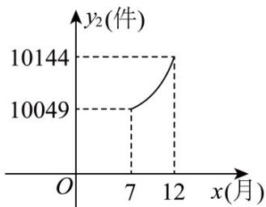

<!-- question-source:start -->
15. 某工厂进行加工生产所的工料两种供应方式，一种是从市场上直接采购工料，另一种是通过工厂自身生

产工料，该工厂去年（2月至12月）每月所需的工料总量均为12000件，由于工厂生产车间处于调试阶段，

自身生产的工料有限，于是工厂从市场上采购一部分工料作为补充，两种供应方式同时进行，2月至6月，

该工厂从市场上采购的工料量 $y_{1}$ （件）与月份 $x(2 \leq x \leq 6$ ，且 $x$ 为整数）之间满足的函数关系如下表

<table><tr><td>月份 $x$ (月)</td><td>2</td><td>3</td><td>4</td><td>5</td><td>6</td></tr><tr><td>市场采购工料量 $y_1$ (件)</td><td>6000</td><td>4000</td><td>3000</td><td>2400</td><td>2000</td></tr></table>

7月至12月，该工厂自身生产的工料量 $y_{2}$ （件）与月份 $x(7\leq x\leq 12$ ，且 $x$ 为取整数）之间满足二次函数关

系式为 $y_{2} = ax^{2} + c (a \neq 0)$ 。其图象如图所示。2月至6月，该工厂每件工料的市场采购成本 $z_{1}$ （元）与月份 $x$ 之

间满足函数关系式 $z_{1} = \frac{1}{2} x$ ，该工厂自身生产的每件工料的成本 $z_{2}$ （元）与月份 $x$ 之间满足函数关系式：

$z_{2}=\frac{3}{4}x-\frac{1}{12}x^{2}$ ；7月至12月的每一个月份，该工厂从市场采购的工料成本均为3元/件，该工厂自身生产的工料成本为1.5元/件。

(1)请观察题中的表格和图象，用所学过的一次函数、反比例函数或二次函数的有关知识，分别求出 $y_{1}, y_{2}$ 与 $x$

之间的函数关系式；

(2)请你求出该工厂去年（2月至12月）哪个月份所需的工料总费用 $W$ （元）最多，并求出这个最多费用。
<!-- question-source:end -->

![[高中/课堂同步/题库/人教A版高中数学同步讲义(2026)/01_必修第一册/第四章 指数函数与对数函数/第四章 指数函数与对数函数（高效培优讲义）/强化训练/questions/answers/Q00075855A1.md]]
