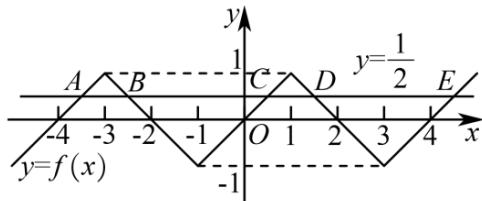

> [!faq]- 《第四章 指数函数与对数函数（高效培优讲义）》官方解析
>
> > [!success]- **【答案】** C
>
> > [!note]- **【解析】**
> > 由题意得方程 $f(x) = \frac{1}{2}$ 的根是函数 $f(x)$ 的图象与直线 $y = \frac{1}{2}$ 的交点的横坐标，
> >
> > 根据分段函数的解析式，以及 $f(x)$ 是定义在 $R$ 上的奇函数，作出函数 $f(x)$ 的图象如图所示：
> >
> > 
> >
> > 作出直线 $y=\frac{1}{2}$ ，由图可知， $y=\frac{1}{2}$ 与 $f(x)$ 的图象有 5 个交点，从左到右依次记为 A, B, C, D, E，
> > 根据 $f(x)=|x-3|-1(x-1)$ 的图象的对称性可得 $x_{D}+x_{E}=6$ 根据 $f(x)$ 是奇函数得， $x_{A} + x_{B} = -6$ 所以 $x_{A} + x_{B} + x_{D} + x_{E} = -6 + 6 = 0$ 由 $\log_{2}(x+1)=\frac{1}{2}$ 得 $x_{C}=\sqrt{2}-1$ 所以 $x_{A} + x_{B} + x_{C} + x_{D} + x_{E} = \sqrt{2} - 1$
> >
> > 故选 **C**
