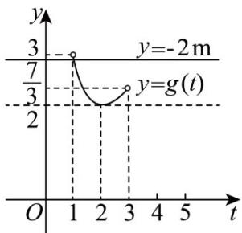

> [!faq]- 《第四章 指数函数与对数函数（高效培优讲义）》官方解析
>
> > [!success]- **【答案】** A. $\{m|m=-1\}$ B. $\{m|m=-1\text{或}m=3\}$ C. $\left\{m\mid m=-1\text{或}-\frac{3}{2}<m\leq-\frac{7}{6}\right\}$ D. $\left\{m\mid m=-1\text{或}-\frac{3}{2}<m<-\frac{7}{6}\right\}$
>
> > [!note]- **【解析】**
> > 解法一：
> >
> > 当函数 $f(x)$ 只有一个零点且在区间 $(0,2)$ 内时，
> >
> > $$
> > \left\{ \begin{array}{l} 0 <   - m <   2 \\ f (- m) = m ^ {2} - 2 m ^ {2} + 2 m + 3 = 0 \end{array} \Rightarrow m = - 1 \right.;
> > $$
> >
> > 当函数 $f(x)$ 有两个零点时， $\Delta = (2m)^2 -4(2m + 3) = 4m^2 -8m - 12 > 0$ ，解得 $m <   - 1$ 或 $m > 3$ 又有在 $(0,2)$ 内只有一个零点，则或 $\left\{ \begin{array}{ll}f(0) = 0 & f(2) = 0\\ f(2) > 0 & f(0) > 0\\ 0 <   - m <   2 & 0 <   - m <   2 \end{array} \right.$ 或或
> >
> > 即 $\left(2m + 3\right)\left(7 + 6m\right) <   0$ 或 $\left\{ \begin{array}{ll}2m + 3 = 0\\ 7 + 6m > 0\\ 0 <   - m <   2 \end{array} \right.$ 或 $\left\{ \begin{array}{ll}7 + 6m = 0\\ 2m + 3 > 0\\ 0 <   - m <   2 \end{array} \right.,$
> >
> > 解得 $-\frac{3}{2} < m < -\frac{7}{6}$ 或 $m \in \emptyset$ 或 $m = -\frac{7}{6}$ .
> >
> > 综上所述，实数 $m$ 的取值范围是 $\left\{m\mid m = -1\text{或} - \frac{3}{2} <  m\leq -\frac{7}{6}\right\}$
> >
> > 故选：C.
> >
> > 解法二：
> >
> > 由 $f(x) = 0$ ，得 $x^{2} + 2m(x + 1) + 3 = 0$ ，又 $x\in (0,2)$ ，所以 $x + 1\in (1,3)$
> >
> > 所以 $-2m=\frac{x^{2}+3}{x+1}=\frac{(x+1-1)^{2}+3}{x+1}=x+1+\frac{4}{x+1}-2$
> >
> > 令 $t = x + 1$ ， $t\in (1,3)$ ， $g(t) = t + \frac{4}{t} -2$ ，要使 $f(x)$ 在区间 $(0,2)$ 内只有一个零点，
> >
> > 只需直线 $y = -2m$ 与 $g(t)$ 的图象在 $(1,3)$ 上只有一个交点，作出两函数图象如图所示，
> >
> > 
> >
> > 由图可知 $\frac{7}{3} \leq -2m < 3$ 或 $-2m = 2$ ，解得 $-\frac{3}{2} < m \leq -\frac{7}{6}$ 或 $m = -1$ ，
> >
> > 所以 $m$ 的取值范围是 $\left\{m\left| -\frac{3}{2} < m \leq -\frac{7}{6}\right.\right.$ 或 $m = -1\}$
> >
> > 故选 **C**.
