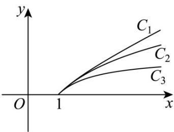

> [!faq]- 《第四章 指数函数与对数函数（高效培优讲义）》官方解析
>
> > [!success]- **【答案】**  A. $C_1$ ， $C_2$ ， $C_3$ B. $C_3$ ， $C_2$ ， $C_1$ C. $C_2$ ， $C_3$ ， $C_1$ D. $C_1$ ， $C_3$ ， $C_2$
>
> > [!note]- **【解析】**
> > 令 $x = 2$ ，可得 $f(2) = \ln 2$ ， $g(2) = 1 - \frac{1}{2} = \frac{1}{2}$ ， $h(2) = \frac{1}{2}\left(2 - \frac{1}{2}\right) = \frac{3}{4}$ 因为 $4 > e$ ，可得 $2 > e^{\frac{1}{2}}$ ， $\ln 2 > \ln e^{\frac{1}{2}} = \frac{1}{2}$ ，又因为 $16 < e^3$ ，可得 $2 < e^{\frac{3}{4}}$ ，即 $\ln 2 < \frac{3}{4}$ 所以 $h(2) > f(2) > g(2)$ ，所以 $f(x)$ ， $g(x)$ ， $h(x)$ 的图象依次为图中的 $C_2, C_3, C_1$
> >
> > 故选 **C**.
