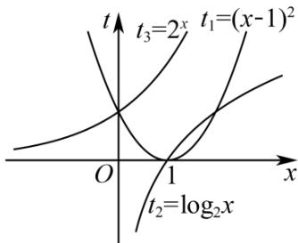

> [!faq]- 《第四章 指数函数与对数函数（高效培优讲义）》官方解析
>
> > [!success]- **【答案】** (1) $a = 2$ (2) $t_2 < t_1 < t_3$
>
> > [!note]- **【解析】**
> > （1）由 $f(1) = g(1)$ ，得 $-2 + a = \log_a 1$ ，即 $-2 + a = 0$ ，解得 $a = 2$ ；
> >
> > (2) 由 $a = 2$ ，得 $t_1 = \frac{1}{2} f(x) = x^2 - 2x + 1 = (x - 1)^2$ ， $t_2 = g(x) = \log_2 x$ 。
> >
> > 法一： $y = (x - 1)^2$ 在 $x\in (0,1)$ 上单调递减，故 $t_1\in (0,1)$
> >
> > 由对数函数 $y = \log_2x$ 在 $x\in (0,1)$ 上单调递增，可知 $t_2\in (-\infty ,0)$
> >
> > 由指数函数 $y = 2^{x}$ 在 $x \in (0,1)$ 上单调递增，可得 $t_{3} \in (1,2)$
> >
> > 所以 $t_{2}<t_{1}<t_{3}$ ;
> >
> > <!-- source-part:3 pages:101-106 -->
> >
> > 法二：在同一平面直角坐标系中画出 $t_1 = (x - 1)^2, t_2 = \log_2 x, t_3 = 2^x$ 的图象如下，
> >
> > 
> >
> > 由图，在(0,1)上 $t_{2}<t_{1}<t_{3}$ .
