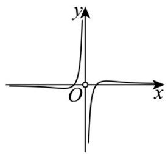
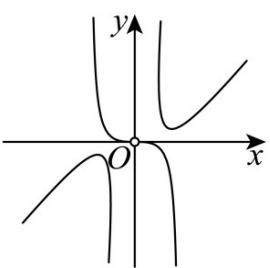
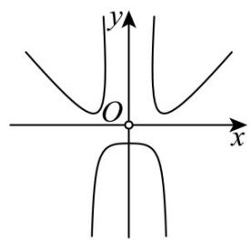
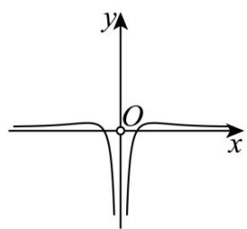

<!-- question-source:start -->
【典例1】函数 $f(x) = \frac{\ln x^2}{\mathrm{e}^x - \mathrm{e}^{-x}}$ 的大致图象是（）

A.

B

C.

D

<!-- question-source:end -->

![[高中/课堂同步/题库/人教A版高中数学同步讲义(2026)/01_必修第一册/第四章 指数函数与对数函数/第四章 指数函数与对数函数（高效培优讲义）/题型06_指数函数与对数函数的图象/questions/answers/Q00075788A1.md]]
