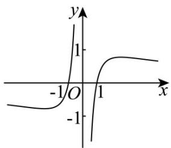
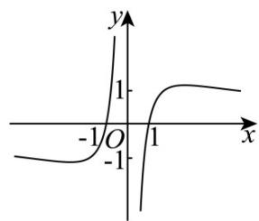
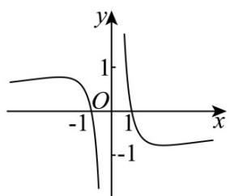
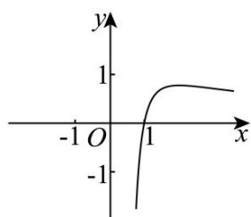

> [!faq]- 《第四章 指数函数与对数函数（高效培优讲义）》官方解析
>
> > [!success]- **【答案】** A.  B  C.  D 
>
> > [!note]- **【解析】**
> > 易知函数 $f(x) = \frac{\ln x^2}{x}$ 的定义域为 $\{x, x \neq 0\}$
> >
> > 因为 $f(-x) = \frac{\ln(-x)^2}{-x} = \frac{\ln x^2}{-x} = -f(x)$ ，所以，函数 $f(x)$ 为奇函数，排除D.
> >
> > 又当 $x > 1$ 时， $\ln x^2 >\ln 1 = 0$ ，则 $f(x) > 0$ ，排除C.
> >
> > 又 $f(2) = \frac{\ln 4}{2} = \ln 2 < 1$ ，排除B.
> >
> > 故选 **A**.
