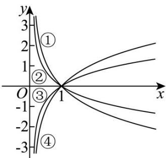

> [!faq]- 《第四章 指数函数与对数函数（高效培优讲义）》官方解析
>
> > [!success]- **【答案】**  A. ① B. ② C. ③ D. ④
>
> > [!note]- **【解析】**
> > 根据题意函数 $y = \log_{\frac{1}{2}} x, y = \log_{2} x, y = \log_{3} x$ 中两个底数 a > 1，图象单调递增，故③，④满足题意
> >
> > 根据增长规律，“在定点右边，顺时针底数越来越大”，知道③对应 $y = \log_{3} x$ ，④对应 $y = \log_{2} x$ 。
> >
> > 由于函数 $y = \log_{\frac{1}{2}} x = -\log_{2} x$ ，则它与 $y = \log_{2} x$ 关于 $x$ 轴对称，且①与④关于 $x$ 轴对称。故函数 $y = \log_{\frac{1}{2}} x$ 图象为①.
> >
> > 则②不属于函数 $y=\log_{\frac{1}{2}}x,\ y=\log_{2}x,\ y=\log_{3}x$ 的一个.
> >
> > 故选 **B**.
