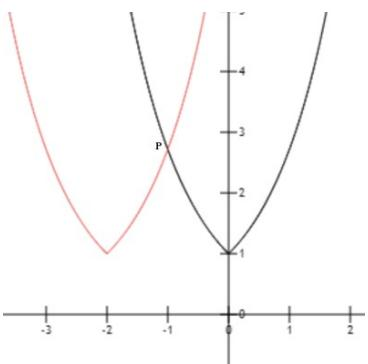
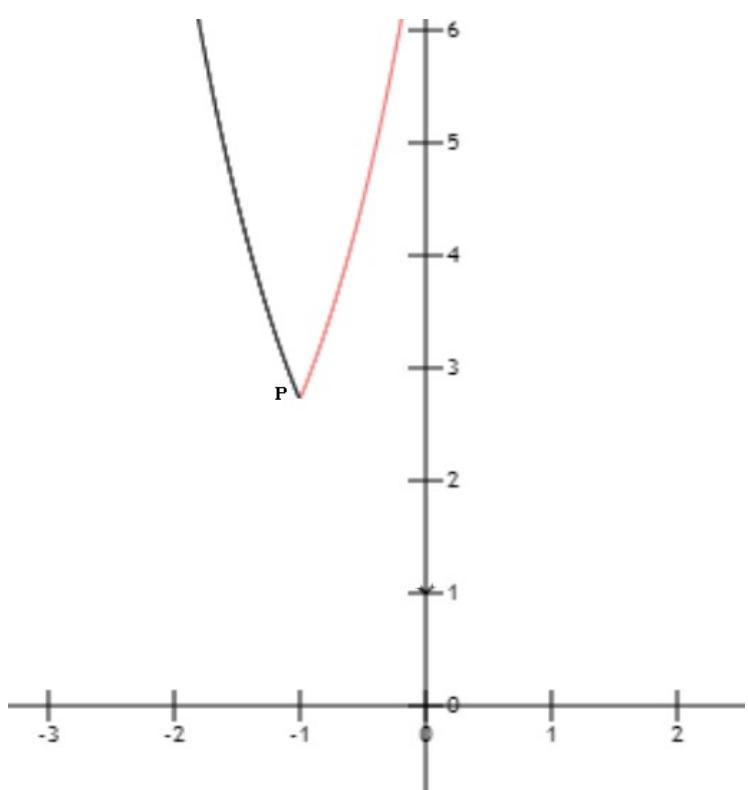

> [!faq]- 《第四章 指数函数与对数函数（高效培优讲义）》官方解析
>
> > [!success]- **【答案】** A
>
> > [!note]- **【解析】**
> > 根据函数 $f(x)=\max\{e^{|x|},e^{|x+2|}\}$ ，画出 $f(x)=e^{|x|},f(x)=e^{|x+2|}$ 图像如下图所示：
> >
> > 
> >
> > 取最大值后函数图像为:
> >
> > 
> >
> > 由图像可知,当 x = -1 时取得最小值,即 $f(x) = e^{|-1|} = e^{|-1+2|} = e$
> >
> > 故选 **A**
