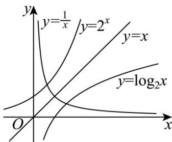

> [!faq]- 《第四章 指数函数与对数函数（高效培优讲义）》官方解析
>
> > [!success]- **【答案】** D
>
> > [!note]- **【解析】**
> > 因为 $a \cdot 2^a = b \cdot \log_2 b = 1$ ，所以 $2^a = \frac{1}{a}$ ， $\log_2 b = \frac{1}{b}$
> >
> > 所以 $a$ ， $b$ 分别是 $y = 2^{x}$ ， $y = \log_2x$ 与 $y = \frac{1}{x}$ 图象交点的横坐标，
> >
> > 因为 $y = 2^{x}$ ， $y = \log_2 x$ 的图象关于直线 $y = x$ 对称， $y = \frac{1}{x}$ 也关于直线 $y = x$ 对称，
> >
> > 所以两交点 $\left(a,2^{a}\right)$ ， $\left(b,\log_{2}b\right)$ 关于直线y=x对称，
> >
> > 所以 $a = \log_{2}b$ ， $b = 2^{a}$ ，所以 $2^{a} + a = b + \log_{2}b$ ，故 A 正确；
> >
> > 因为 $a = \log_{2}b$ ， $b = 2^{a}$ ，所以 $a + b = \log_{2}b + 2^{a}$ ，故 B 正确；
> >
> > 因为 $b = 2^{a}$ ，所以 $ab = a \cdot 2^{a} = 1$ ，故C正确；
> >
> > 
> >
> > 若 $a + b = 2$ 成立，再结合 $ab = 1$ ，可得 $a = b = 1$ ，与 $a \cdot 2^a = 1$ 矛盾，故D错误.
> >
> > 故选：D.
> >
> > ## 方法技巧
> >
> > 反函数的定义域都由原函数的值域来确定的，特别是当反函数的定义域与由反函数解析式有意义所确定的自
> >
> > 变量的取值范围不一致时，一定要注明反函数的定义域。
