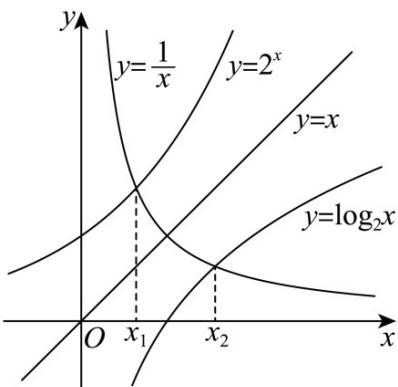

> [!faq]- 《第四章 指数函数与对数函数（高效培优讲义）》官方解析
>
> > [!success]- **【答案】** B
>
> > [!note]- **【解析】**
> > 由题意可得 $f(x_{1})=\frac{1}{x_{1}}-2^{x_{1}}=0$ $2^{x_{1}}=\frac{1}{x_{1}}$ ，可得
> >
> > $g\left(x_{2}\right) = x_{2}\log_{2}x_{2} - 1 = 0$ ，则 $x_{2} > 0$ ，所以， $\log_2x_2 = \frac{1}{x_2}$
> >
> > 作出函数 $y = 2^{x}$ 、 $y = \frac{1}{x}$ 、 $y = \log_2 x$ 的图象如下图所示：
> >
> > 
> >
> > 对于函数 $y=\frac{1}{x}$ 可得 $x=\frac{1}{y}$ ，所以，函数 $y=\frac{1}{x}$ 的图象关于直线 y=x 对称，
> >
> > 又因为函数 $y = 2^{x}$ 、 $y = \log_{2} x$ 的图象关于直线 $y = x$ 对称，
> >
> > 所以，点 $\left(x_{1},\frac{1}{x_{1}}\right)$ 、 $\left(x_2,\frac{1}{x_2}\right)$ 关于直线 $y = x$ 对称，则 $x_{1} = \frac{1}{x_{2}}$ ，故 $x_{1}x_{2} = 1$
> >
> > 故选 **B**.
