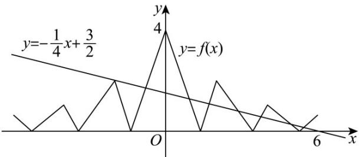

> [!faq]- 《第四章 指数函数与对数函数（高效培优讲义）》官方解析
>
> > [!success]- **【答案】** C
>
> > [!note]- **【解析】**
> > $g(x)=f(x)+\frac{1}{4}x-\frac{3}{2}$ 的零点，则 $f(x)+\frac{1}{4}x-\frac{3}{2}=0$ ，即 $f(x)=-\frac{1}{4}x+\frac{3}{2}$ 的根个数，
> > 画出 $y = -\frac{1}{4}x + \frac{3}{2}$ 与 $y = f(x)$ 图像，看两个函数图像交点个数即可.
> > 当 $0 \leq x \leq 2$ 时， $f(x)=|3x-4|$ ，画出此部分图像，再根据当 $x=0$ 时， $f(x+2)=\frac{1}{2}f(x)$ ，
> > 即表示 x 隔 2 函数值减半，画出 y 轴右侧图像。最后根据偶函数图像性质，得到 y 轴左侧图像。
> >
> > 
> >
> > 根据图像，知道 $g(x) = f(x) + \frac{1}{4} x - \frac{3}{2}$ 的零点个数是8个.
> >
> > 故选 **C**.
