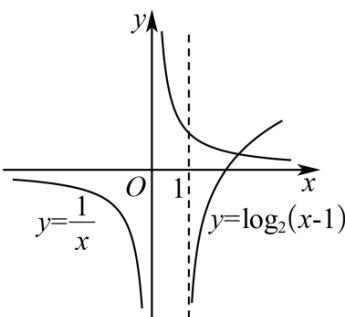

> [!faq]- 《第四章 指数函数与对数函数（高效培优讲义）》官方解析
>
> > [!success]- **【答案】** (1)a=2 (2) $(2,3)$ (3)1
>
> > [!note]- **【解析】**
> > （1）因为函数 $f(x) = \log_a(x - 1) + 2$ （ $a > 0$ 且 $a \neq 1$ ）的图象过点 $(3,3)$ 所以 $f(3) = \log_a2 + 2 = 3$ ，解得 $a = 2$ 。
> >
> > (2) 由复合函数的单调性知 $f(x) = \log_2(x - 1) + 2$ 在 $(1, +\infty)$ 上单调递增，又 $f(2^x - 3) < f(21 - 2^{x+1})$ ，所以 $\begin{cases} 2^x - 3 > 1, \\ 21 - 2^{x+1} > 1, \\ 21 - 2^{x+1} > 2^x - 3, \end{cases}$ 即 $\begin{cases} 2^x > 4, \\ 2^x < 10, \\ 2^x < 8, \end{cases}$ 即 $4 < 2^x < 8$ ，解得 $2 < x < 3$ ，所以不等式的解集为 $(2,3)$ （3）由（1）得函数 $g(x) = \log_2(x - 1) - \frac{1}{x}$ ，令 $g(x) = 0$ ，得 $\log_2(x - 1) = \frac{1}{x}$ ，则函数 $g(x)$ 的零点个数即为函数 $y = \log_2(x - 1)$ 与 $y = \frac{1}{x}$ 的图象交点的个数，作出函数 $y = \log_2(x - 1)$ 与 $y = \frac{1}{x}$ 的图象，如图所示，
> >
> > 
> >
> > 由图象知，函数 $g(x)$ 的零点个数为1.
