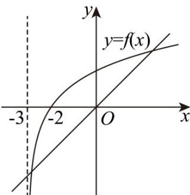

> [!faq]- 《第四章 指数函数与对数函数（高效培优讲义）》官方解析
>
> > [!success]- **【答案】** -3或2
>
> > [!note]- **【解析】**
> > 由题意得 $f(x)$ 的定义域为 $x \in (-3, +\infty)$
> >
> > 令 $\log_2(x + 3) - x = 0$ ，则 $\log_2(x + 3) = x$
> >
> > 可得函数 $f(x)$ 的零点为函数 $y=\log_{2}(x+3)$ 的图象与 y=x 的图象交点的横坐标，
> >
> > 如答图15-18，可知交点有两个，其中一个交点的横坐标 $x_0$ 满足 $x_0 \in (-3, -2)$
> >
> > 
> > 答图15-18
> >
> > 而函数 $f(x)$ 的零点 $x_0 \in (k, k + 1)$ ，解得 $k = -3$
> >
> > 而 $f(2) = \log_25 - 2 > 0$ ， $f(3) = \log_26 - 3 < 0$
> >
> > 则 $f(2) \cdot f(3) < 0$ ，由零点存在性定理得存在 $x_{1} \in (2,3)$ 作为 $f(x)$ 零点，
> >
> > 因为该零点满足 $x_{0} \in (k, k + 1)$ ，且 k 为整数，所以 k = 2，
> >
> > 综上，k = -3 或 2.
> >
> > 故答案为：-3 或 2
