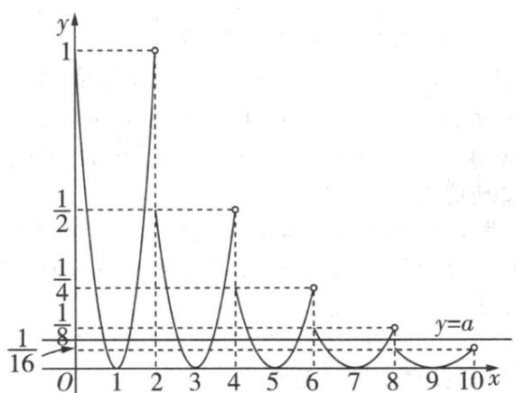

题型19 已知函数零点的个数求参数或参数的取值范围【典例1】定义在 $[0, +\infty)$ 上的函数 $f(x)$ 满足 $f(x + 2) = \frac{1}{2} f(x)$ ，当 $x \in [0, 2)$ 时， $f(x) = x^2 - 2x + 1$ ，若直线 $y = a$ 与 $f(x)$ 的图象恰有8个交点 $\left(x_1, y_1\right), \left(x_2, y_2\right), \ldots, \left(x_8, y_8\right)$ ，则实数 $a$ 的取值范围为 \_\_\_\_， $x_1 + x_2 + \cdots + x_8 =$ \_\_\_\_. 【答案】 $\left(\frac{1}{16}, \frac{1}{8}\right)$ 32

【详解】因为定义在 $[0, +\infty)$ 上的函数 $f(x)$ 满足 $f(x + 2) = \frac{1}{2} f(x)$ ，

当 $x \in [0,2)$ 时， $f(x) = x^2 - 2x + 1$

所以当 $x \in [2,4)$ 时， $f(x) = \frac{1}{2} f(x - 2) = \frac{1}{2}(x - 3)^2$

当 $x\in [4,6)$ 时， $f(x) = \frac{1}{2} f(x - 2) = \frac{1}{4} f(x - 4) = \frac{1}{4}(x - 5)^2$

当 $x \in [6,8)$ 时， $f(x) = \frac{1}{8} f(x - 6) = \frac{1}{8}(x - 7)^2$

当 $x \in [8,10)$ 时， $f(x) = \frac{1}{16} f(x - 8) = \frac{1}{16}(x - 9)^2$

作出函数 $f(x)$ 与 $y = a$ 在 $[0,10)$ 上的图象如图所示.

由图可知，当 $\frac{1}{16} < a < \frac{1}{8}$ 时，直线 $y = a$ 与函数 $f(x)$ 的图象有8个交点，

不妨设 $x_{1}<x_{2}<\cdots<x_{8}$ ，结合图可知，点 $(x_{1},y_{1})$ ， $(x_{2},y_{2})$ 关于直线 x=1 对称，

则 $x_{1} + x_{2} = 2$ ，同理可得 $x_{3} + x_{4} = 6$ ， $x_{5} + x_{6} = 10$ ， $x_{7} + x_{8} = 14$

因此， $x_{1}+x_{2}+\cdots+x_{8}=2+6+10+14=32$

故答案为： $\left(\frac{1}{16},\frac{1}{8}\right)$ ；32.

## 方法技巧

一般情况下，常利用数形结合法，在求解的过程中，解题的思路是将函数零点个数问题转化

为方程解的个数问题，将式子移项变形，转化为两函数图象的交点问题，画出函数的图象以

及相应的直线，在直线移动的过程中，利用数形结合思想，求得相应的结果。

![[高中/课堂同步/题库/人教A版高中数学同步讲义(2026)/01_必修第一册/第四章 指数函数与对数函数/第四章 指数函数与对数函数（高效培优讲义）/_compact/Q00075839.md]]
![[高中/课堂同步/题库/人教A版高中数学同步讲义(2026)/01_必修第一册/第四章 指数函数与对数函数/第四章 指数函数与对数函数（高效培优讲义）/_compact/Q00075840.md]]
![[高中/课堂同步/题库/人教A版高中数学同步讲义(2026)/01_必修第一册/第四章 指数函数与对数函数/第四章 指数函数与对数函数（高效培优讲义）/_compact/Q00075841.md]]
