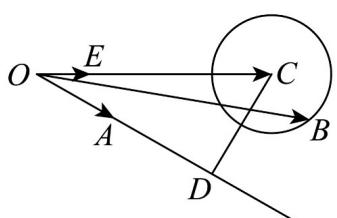
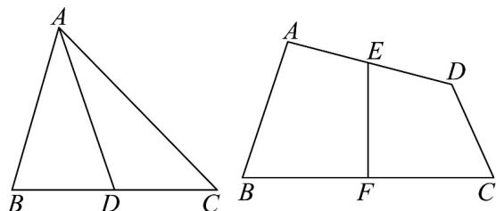
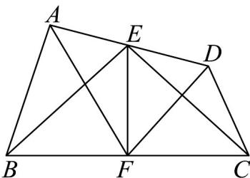

> [!faq]- 《高一数学下学期第一次月考_人教A版_高效培优_强化卷_》官方解析
>
> > [!success]- **【答案】** D
>
> > [!note]- **【解析】**
> > 由 $e$ 是单位向量， $b^2 - 8b \cdot e + 15 = 0$ ，得 $(b - 4e)^2 = 1$ ，即 $|b - 4e| = 1$
> >
> > 作向量 $OE = e, OC = 4e, OB = b$ ，则 $|CB| = |OB - OC| = 1$
> >
> > 点 B 的轨迹是以 C 为圆心，1 为半径的圆，
> >
> > 
> >
> > 由 $\langle a, e \rangle = \frac{5\pi}{6}$ ，得 $\langle -a, e \rangle = \frac{\pi}{6}$ ，作向量 $OA = -a$ ， $\angle AOE = \frac{\pi}{6}$
> >
> > 过 C 作射线 OA 的垂线 CD ，垂足为 D ，
> >
> > 所以 $\left|b+a\right|_{\min}=\left|OB-OA\right|_{\min}=\left|CD\right|-1=\left|OC\right|\sin\frac{\pi}{6}-1=1$
> >
> > 故选：D
> >
> > ## 二、选择题：本题共3小题，每小题6分，共18分．在每小题给出的选项中，有多项符合题目要求．全部选对的得6分，部分选对的得部分分，有选错的得0分.
> >
> > 9. 物理中位移的合成是向量加法的几何基础，例如：在 $VABC$ 中， $D$ 为线段 $BC$ 中点（如左图），在封闭
> >
> > 回路 $ABD$ 中， $AD = AB + BD$ ；在封闭回路 $ACD$ 中， $AD = AC + CD$ ；将两式相加，由于 $BD$ 和 $CD$ 互为相
> >
> > 反向量，其和为0，整理可得 $\overset{\square\square}{AD}=\frac{1}{2}\left(\overset{\square\square}{AB}+\overset{\square\square}{AC}\right)$ 。类比这个过程，在右图的四边形ABCD中，E、F分别
> >
> > 为线段 $AD$ 、 $BC$ 中点，则（）
> >
> > 
> >
> > A. $EF = \frac{1}{2} \left( AB + DC \right)$
> >
> > B. $EF = \frac{1}{2} \left( AC + DB \right)$
> >
> > C. $EF = \frac{1}{2} \left( AD + BC \right)$
> >
> > D. $EF = \frac{1}{4} \left( AF + DF + BE + CE \right)$
> >
> > 【答案】AB
> >
> > 【详解】因为 $EF = EA + AB + BF, EF = ED + DC + CF$
> >
> > 则 $2\overline{EF} = \left(\overline{EA} +\overline{ED}\right) + \left(\overline{AB} +\overline{DC}\right) + \left(\overline{BF} +\overline{CF}\right)$
> >
> > 且 $E, F$ 分别为 $AD$ ， $BC$ 的中点，则 $EA + ED = 0, BF + CF = 0$
> >
> > 所以 $2\overline{EF} = 0 + \left( \overline{AB} + \overline{DC} \right) + 0 = \overline{AB} + \overline{DC}$ . 即 $\overline{EF} = \frac{1}{2} \left( \overline{AB} + \overline{DC} \right)$ , A 正确,
> >
> > 又 $AC + DB = AB + BC + DC + CB = AB + DC$
> >
> > 所以 $EF = \frac{1}{2} \left( AC + DB \right)$ ，B 正确，
> >
> > $$
> > \stackrel {\text {   }} {A D} + \stackrel {\text {   }} {B C} - \stackrel {\text {   }} {A B} - \stackrel {\text {   }} {D C} = \stackrel {\text {   }} {A D} - \stackrel {\text {   }} {A B} + \stackrel {\text {   }} {B C} + \stackrel {\text {   }} {C D} = 2 B D
> > $$
> >
> > 即 $AD + BC \neq AB + DC$
> >
> > 即 $EF \neq \frac{1}{2} \left( AD + BC \right)$ , C 错误；
> >
> > 
> >
> > 如图：
> >
> > 由条件可知 $2EF = EB + EC$
> >
> > $2FE = FA + FD$ ，即 $2EF = AF + DF$
> >
> > 所以 $4EF = AF + DF + EB + EC$
> >
> > 即 $EF = \frac{1}{4}\left(AF + DF + EB + EC)\right)$ ，故 D 错误，
> >
> > 故选 **AB**
