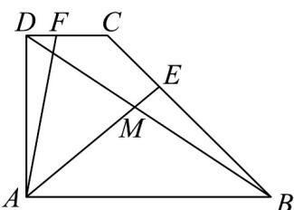

<!-- question-source:start -->
15. (13分)

在直角梯形 $ABCD$ 中，已知 $AB//DC$ ， $AD \perp AB$ ， $CD = 1$ ， $AD = 2$ ， $AB = 3$ ，动点 $E$ 、 $F$ 分别在线段 $BC$ 和

$DC$ 上， $AE$ 和 $BD$ 交于点 $M$ ，且 $\overline{BE} = \lambda \overline{BC}$ ， $\overline{DF} = (1 - \lambda)\overline{DC}$ ， $\lambda \in [0,1]$

(1)当 $\lambda=\frac{1}{2}$ 时，求 $\overline{AE}\cdot\overline{BD}$ 的值；

(2)当 $\lambda = \frac{2}{3}$ 时，求 $\frac{DM}{MB}$ 的值；

(3)求 $\left|\frac{1}{2}AF+\frac{1}{2}AE\right|$ 的取值范围.
<!-- question-source:end -->

![[高中/课堂同步/题库/人教A版高中数学同步讲义(2026)/02_必修第二册/月考/阶段测试/高一数学下学期第一次月考_人教A版_高效培优_强化卷_/四_解答题_sec_05/questions/answers/Q00063697A1.md]]
