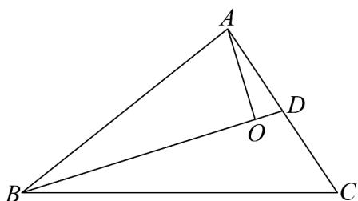

> [!faq]- 《高一数学下学期第一次月考_人教A版_高效培优_提升卷_》官方解析
>
> > [!success]- **【答案】** 3
>
> > [!note]- **【解析】**
> > ∵ $\overline{OA}$ 与 $\overline{OB}$ 的夹角为 $120^{\circ}$ ， $\overline{OA}$ 与 $\overline{OC}$ 的夹角为 $30^{\circ}$ ，且 $\left|\overline{OA}\right|=\left|\overline{OB}\right|=1,\quad\left|\overline{OC}\right|=\sqrt{3}$ ；
> > ∴ $\overline{OC} = \lambda \overline{OA} + \mu \overline{OB}$ 两边平方得： $3 = \lambda^{2} - \lambda \mu + \mu^{2}$ ①；
> >
> > 对 $\overline{OC} = \lambda \overline{OA} + \mu \overline{OB}$ 两边点乘 $\overline{OA}$ 得： $\frac{3}{2} = \lambda - \frac{\mu}{2}$ ，两边平方得： $\frac{9}{4} = \lambda^{2} - \lambda \mu + \frac{\mu^{2}}{4}$ ②；
> > - **①**：- ②得： $\frac{3\mu^{2}}{4}=\frac{3}{4}$ ；根据图象知， $\mu>0$ ，
> >
> > $\therefore \mu=1$ ，代入 $\frac{3}{2}=\lambda-\frac{\mu}{2}$ 得， $\lambda=2$ ；
> >
> > $\therefore \lambda +\mu = 3$
> >
> > 故答案为：3
> >
> > 14. O 为 $\triangle ABC$ 内一点，且 $\overline{AO} = \frac{1}{7} \overline{AB} + \frac{3}{7} \overline{AC}$ ，则 $\triangle AOB$ 的面积与 $\triangle ABC$ 的面积的比值为 \_\_\_\_
> > 【答案】 $\frac{3}{7}$
> >
> > 【详解】取 AC 的中点为 D，连接 BD，如下图所示：
> >
> > 
> >
> > 易知 $\overset{\square}{A}C = 2\overset{\square}{A}D$ ，所以 $\overset{\square}{A}O = \frac{1}{7}\overset{\square}{A}B + \frac{6}{7}\overset{\square}{A}D$ ，
> >
> > 因此可得 $O, B, D$ 三点共线，
> >
> > 易知 $\triangle AOB$ 与 $\triangle ABC$ 的公共边为 $AB$ ，设 $D$ 点到边 $AB$ 的距离为 $h$ ，
> >
> > 可知 O 到边 AB 的距离为 $\frac{6}{7}h$ ，C 到边 AB 的距离为 2h，
> >
> > 所以 $\frac{S_{\triangle AOB}}{S_{\triangle ABC}}=\frac{\frac{1}{2}AB\cdot\frac{6}{7}h}{\frac{1}{2}AB\cdot2h}=\frac{3}{7}$
> >
> > 故答案为： $\frac{3}{7}$
