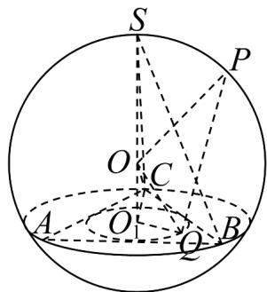

> [!faq]- 《高一数学下学期第三次月考卷_人教A版_高效培优_》官方解析
>
> > [!success]- **【答案】** $\frac{9\sqrt{5}+\sqrt{105}}{10}$
>
> > [!note]- **【解析】**
> > 如图，设球心为 O，外接球的半径为 R，VABC 的内切圆圆心为 $O_{1}$ ，
> >
> > 则S、O、 $O_{1}$ 三点共线，连接OC、 $O_{1}C$ ，
> >
> > 在 $\triangle SCO_{1}$ 中，由勾股定理得 $SO_{1}=\sqrt{3^{2}-\left(\frac{2}{3}\times\frac{2\sqrt{3}}{2}\cdot\sqrt{3}\right)^{2}}=\sqrt{5}$
> >
> > 在 $\triangle OO_{1}C$ 中，由勾股定理得 $OO_{1}^{2} + O_{1}C^{2} = OC^{2}$
> >
> > 即 $\left(\sqrt{5} - R\right)^2 + 2^2 = R^2$ ，整理得 $R = \frac{9\sqrt{5}}{10}$
> >
> > 设VABC内切圆的半径为 $r$ ，则有 $S_{\triangle ABC} = \frac{1}{2} rC_{\triangle ABC}$
> >
> > 故 $r=\frac{2S_{\triangle ABC}}{C_{\triangle ABC}}=\frac{2\times\frac{\sqrt{3}}{4}\times\left(2\sqrt{3}\right)^{2}}{3\times2\sqrt{3}}=1$ ，
> >
> > 由 Q 是 VABC 内切圆上一点，则 $O_{1}Q = 1$ ，
> >
> > 在直角 $\triangle OO_{1}Q$ 中，由勾股定理得 $OO_{1}^{2} + O_{1}Q^{2} = OQ^{2}$
> >
> > 即 $OQ = \sqrt{\left(\sqrt{5} - \frac{9\sqrt{5}}{10}\right)^2 + 1^2} = \frac{\sqrt{105}}{10}$ ，
> >
> > $$
> > \text {则} \left| P Q \right| \leq \left| O P \right| + \left| O Q \right| = \frac {9 \sqrt {5}}{1 0} + \frac {\sqrt {1 0 5}}{1 0} = \frac {9 \sqrt {5} + \sqrt {1 0 5}}{1 0}
> > $$
> >
> > 当且仅当 P、O、Q 三点共线且 O 在 P、Q 之间时等号成立.
> >
> > 
> >
> > 四、解答题：本题共5小题，共77分。解答应写出文字说明、证明过程或演算步骤。
