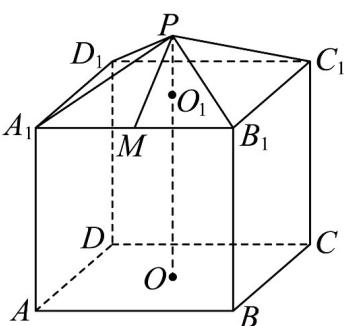
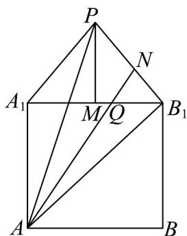

> [!faq]- 《高一数学下学期第三次月考卷_人教A版_高效培优_》官方解析
>
> > [!success]- **【答案】** (1)该几何体的体积为240，表面积为 $180+12\sqrt{13}$ .(2) $\frac{8\sqrt{5}+12}{3}$
>
> > [!note]- **【解析】**
> > （1）由题可知，正四棱锥 $P-A_{1}B_{1}C_{1}D_{1}$ 中 $A_{1}D_{1}=A_{1}B_{1}=AB=6$
> >
> > 过点 $P$ 作 $PM \perp A_{1}B_{1}$ ，垂足为 $M$ ，则 $PM = \sqrt{PO_{1}^{2} + O_{1}M^{2}} = \sqrt{4 + 9} = \sqrt{13}$
> >
> > 正四棱锥 $P-A_{1}B_{1}C_{1}D_{1}$ 的体积为 $V_{P-A_{1}B_{1}C_{1}D_{1}}=\frac{1}{3}S_{A_{1}B_{1}C_{1}D_{1}}\cdot PO_{1}=\frac{1}{3}A_{1}B_{1}^{2}\times2=\frac{1}{3}AB^{2}\times2=24$
> >
> > 侧面积为 $S_{1}=4\times\frac{1}{2}\times6\times\sqrt{13}=12\sqrt{13}$ .
> >
> > 因为 $AA_{1} = BB_{1} = CC_{1} = DD_{1} = OO_{1} = 6$
> >
> > 所以正四棱柱 $ABCD-A_{1}B_{1}C_{1}D_{1}$ 的体积为 $AB^{2}\cdot OO_{1}=36\times3PO_{1}=216$
> >
> > 去掉上底面的表面积为 $S_{2}=5\times6\times6=180$
> >
> > 所以该几何体的体积为 $24 + 216 = 240$ ，表面积为 $12\sqrt{13} + 180 = 180 + 12\sqrt{13}$
> >
> > (2) 如图，将侧面 $PA_{1}B_{1}$ 和侧面 $ABB_{1}A_{1}$ 展开，
> >
> > 易知 $AQ + QN$ 的最小值为展开图中 $A, Q, N$ 三点共线时 $AN$ 的最小值，
> >
> > 即展开图中点 A 到线段 $PB_{1}$ 上点的最小值.
> >
> > 由题可知 $AA_{1}=BB_{1}=OO_{1}=3PO_{1}=6$ ， $PB_{1}=6$
> >
> > 过点 P 作 $PM \perp A_{1}B_{1}$ ，垂足为 M，则 $PM^{2} = PO_{1}^{2} + O_{1}M^{2}$
> >
> > 因为正方形 $A_{1}B_{1}C_{1}D_{1}$ 中， $O_{1}M = B_{1}M$ ，所以 $PB_{1}^{2} = PM^{2} + MB_{1}^{2} = PO_{1}^{2} + 2MB_{1}^{2}$ .
> >
> > 所以 $2MB_{1}^{2}=PB_{1}^{2}-PO_{1}^{2}=32$ ，所以 $MB_{1}=4$ ，所以 $AB=A_{1}B_{1}=8$
> >
> > 因为 $AP^{2}=\left(\frac{AB}{2}\right)^{2}+\left(6+PM\right)^{2}=72+24\sqrt{5}$ ， $AB_{1}=\sqrt{AB^{2}+BB_{1}^{2}}=10$
> >
> > 因为 $\cos APB_{1}=\frac{AP^{2}+PB_{1}^{2}-AB_{1}^{2}}{2AP\cdot PB_{1}}=\frac{8+24\sqrt{5}}{2\sqrt{72+24\sqrt{5}}\cdot6}>0$ ，所以 $\angle APB_{1}$ 为锐角；
> >
> > $\cos \angle AB_{1}P = \frac{AB_{1}^{2} + PB_{1}^{2} - AP^{2}}{2AB_{1}\cdot PB_{1}} = \frac{64 - 24\sqrt{5}}{120} = \frac{8 - 3\sqrt{5}}{15} >0$ ，所以 $\angle PB_{1}A$ 为锐角，
> >
> > 所以 AN 的最小值为点 A 到 $PB_{1}$ 的距离.
> >
> > 所以 $AN_{\mathrm{min}} = AB_{1}\sin \angle AB_{1}P = 10\sqrt{1 - \left(\frac{8 - 3\sqrt{5}}{15}\right)^2} = 10\times \frac{4\sqrt{5} + 6}{15} = \frac{8\sqrt{5} + 12}{3}$
> >
> > 即 $AQ + QN$ 的最小值为 $\frac{8\sqrt{5} + 12}{3}$
> >
> > 
> >
> > 
