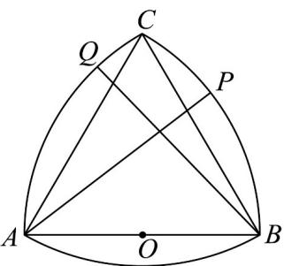

<!-- question-source:start -->
11．如图所示，分别以等边三角形 ABC 的顶点 A, B, C 为圆心，线段 AB 的长为半径画圆弧 BC，AC，
AB，三段圆弧围成一个曲边三角形.已知 $AB = 2$ ，O 为 AB 的中点，点 P，Q 分别在 BC，AC 上，若 $\angle PAB = \angle CBQ + \frac{\pi}{6}$ ，则（）

A. $\left|PQ\right|$ 的最小值是 $2\sqrt{2}-2$ B. $\left|PQ\right|$ 可以取到 $2\sqrt{2}$

C. $OP \cdot OQ$ 的最大值是 $2\sqrt{2} - 1$ D. $OP \cdot OQ$ 可以取到1
<!-- question-source:end -->

![[高中/课堂同步/题库/人教A版高中数学同步讲义(2026)/02_必修第二册/月考/高一数学下学期第一次月考（人教A版必修第二册第六章平面向量~第七章复数，高效培优·强化卷）/一_选择题/questions/answers/Q00076775A1.md]]
