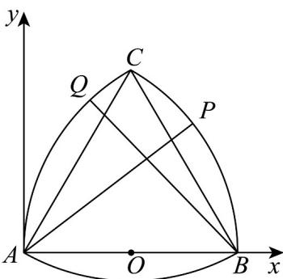

> [!faq]- 《高一数学下学期第一次月考（人教A版必修第二册第六章平面向量~第七章复数，高效培优·强化卷）》官方解析
>
> > [!success]- **【答案】** AC
>
> > [!note]- **【解析】**
> > 如图，设 $A(0,0)$ ， $B(2,0)$
> >
> > 
> >
> > 根据等边三角形性质，则 $C(1,\sqrt{3})$ ，O为AB的中点，故 $O(1,0)$ ；
> >
> > 圆弧 BC 以 A 为圆心，半径为 2；AC 以 B 为圆心，半径为 2.
> >
> > 设 $\angle PAB = \alpha$ ，则 $P$ 在 $\overline{BC}$ 上，坐标 $P(2\cos \alpha, 2\sin \alpha)$ ， $\alpha \in \left[\frac{\pi}{6}, \frac{\pi}{3}\right]$
> >
> > $\angle CBQ = \beta$ ，且 $\alpha = \beta + \frac{\pi}{6}$ ，故 $\beta \in \left[0, \frac{\pi}{6}\right]$ .
> >
> > $Q$ 在 $AC$ 上，以 $B(2,0)$ 为圆心， $\overrightarrow{BQ} = \left(2\cos \left(\frac{2\pi}{3} + \beta\right), 2\sin \left(\frac{2\pi}{3} + \beta\right)\right)$ ，所以 $Q(2 - 2\sin \alpha, 2\cos \alpha)$ .
> >
> > 由 $\overrightarrow{PQ} = (x_{Q} - x_{p},y_{Q} - y_{P})$ 得： $\left|\overrightarrow{PQ}\right| = 2\sqrt{3 - 2(\sin\alpha + \cos\alpha)} = 2\sqrt{3 - 2\sqrt{2}\sin\left(\alpha + \frac{\pi}{4}\right)}$
> >
> > 在 $\alpha \in \left[\frac{\pi}{6},\frac{\pi}{3}\right]$ 时，当 $\alpha = \frac{\pi}{4}$ 时， $\left|PQ\right|_{\min} = 2\sqrt{3 - 2\sqrt{2}} = 2\sqrt{2} -2$ ，故A对.
> >
> > $\left|\overline{PQ}\right|$ 的最大值在 $\alpha = \frac{\pi}{6}$ 或 $\frac{\pi}{3}$ 处取得， $\left|PQ\right|_{\max} = 2\sqrt{2 - \sqrt{3}} < 2\sqrt{2}$ ，故B错.
> >
> > $$
> > O P \cdot O Q = (2 \cos \alpha - 1) (1 - 2 \sin \alpha) + 4 \sin \alpha \cos \alpha = 2 (\sin \alpha + \cos \alpha) - 1
> > $$
> >
> > $$
> > = 2 \sqrt {2} \sin \left(\alpha + \frac {\pi}{4}\right) - 1
> > $$
> >
> > 当 $\alpha=\frac{\pi}{4}$ 时， $\left(\overline{OP}\cdot\overline{OQ}\right)_{\max}=2\sqrt{2}-1$ ，故 C 正确，
> >
> > 当 $\alpha = \frac{\pi}{6}$ 或 $\frac{\pi}{3}$ 时， $\left( \overline{OP} \cdot \overline{OQ} \right)_{\min} = \sqrt{3} > 1$ ，故D错.
> >
> > 故选 **AC**.
