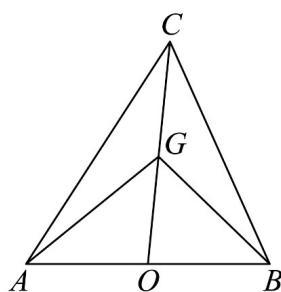

> [!faq]- 《高一数学下学期第一次月考（人教A版必修第二册第六章平面向量~第七章复数，高效培优·强化卷）》官方解析
>
> > [!success]- **【答案】** (1)(i)证明见解析；(ii) $\left(\frac{1}{2},1\right)$ (2) $\left[\frac{4}{5},\frac{\sqrt{6}}{3}\right)$
>
> > [!note]- **【解析】**
> > （1）（i）：因为 $2\cos B + 1 = \frac{c}{a}$
> >
> > 所以 $2a \cos B + a = c$ ，由正弦定理得： $2 \sin A \cos B + \sin A = \sin C$ ，
> >
> > 因为 $A + B + C = \pi$ ，所以 $\sin C = \sin(A + B)$
> >
> > 原式等价于 $2\sin A\cos B+\sin A=\sin(A+B)=\sin A\cos B+\sin B\cos A$
> >
> > 得： $\sin A\cos B-\sin B\cos A=-\sin A$
> >
> > $\sin (A - B) = \sin (-A)$ ，又因为 $A\in \left(0,\frac{\pi}{2}\right)$ ， $B\in \left(0,\frac{\pi}{2}\right)$
> >
> > 所以 $A - B = -A$ ，即 $2A = B$
> >
> > (ii) 由 (1) 知 $2A = B$ ，所以 $3A + C = \pi$ ， $\sin 3A = \sin C$
> >
> > $$
> > \frac {\sin A}{\sin C} = \frac {\sin A}{\sin 3 A} = \frac {\sin A}{\sin 2 A \cos A + \sin A \cos 2 A} = \frac {\sin A}{2 \sin A \cos^ {2} A + \sin A \cos 2 A}
> > $$
> >
> > 所以 $\frac{\sin A}{\sin C} = \frac{1}{4\cos^2A - 1}$
> >
> > 因为三角形 ABC 为锐角三角形，
> >
> > 所以 $0 < 2A = B < \frac{\pi}{2}, 0 < \pi - 3A = C < \frac{\pi}{2} \Rightarrow A \in \left(\frac{\pi}{6}, \frac{\pi}{4}\right)$
> >
> > $$
> > 4 \cos^ {2} A - 1 \in (1, 2)
> > $$
> >
> > 所以 $\frac{\sin A}{\sin C}=\frac{1}{4\cos^{2}A-1}\in\left(\frac{1}{2},1\right)$
> >
> > (2) 设 $AB$ 中点为 $O$ , 用向量 $\overline{CA}$ , $\overline{CB}$ 表示向量 $\overline{GA}$ , $\overline{GB}$
> >
> > 
> >
> > $$
> > \square \square \square = \square \square \square - \square \square \square = \square \square \square - \frac {2}{3} \square \square \square = \square \square \square - \frac {2}{3} \times \frac {1}{2} (\square \square + \square \square) = \frac {2}{3} \square \square - \frac {1}{3} \square \square
> > $$
> >
> > 同理，可得 $GB = \frac{2}{3}CB - \frac{1}{3}CA$
> >
> > 由 $AG \perp BG$ 得， $GA \cdot GB = 0$
> >
> > 所以 $\left(\frac{2}{3} \overline{CA} - \frac{1}{3} \overline{CB}\right) \cdot \left(\frac{2}{3} \overline{CB} - \frac{1}{3} \overline{CA}\right) = 0$
> >
> > 所以 $\frac{4}{9} \overline{CA} \cdot \overline{CB} - \frac{2}{9} \overline{CA}^2 - \frac{2}{9} \overline{CB}^2 + \frac{1}{9} \overline{CA} \cdot \overline{CB} = 0$
> >
> > 化简得： $\frac{5}{9}ab\cos C-\frac{2}{9}b^{2}-\frac{2}{9}a^{2}=0$ ，即 $\cos C=\frac{2a^{2}+2b^{2}}{5ab}$ ①
> >
> > 由余弦定理可得： $\cos C = \frac{a^2 + b^2 - c^2}{2ab}$ ②
> >
> > 联立①②得 $a^{2}+b^{2}=5c^{2}$
> >
> > 因为 VABC 为锐角三角形，所以 $\cos A > 0$ ， $\cos B > 0$ ，
> >
> > 则有： $\left\{ \begin{array}{l}a^{2} + c^{2} > b^{2}\\ b^{2} + c^{2} > a^{2} \end{array} \right.$ ，则 $\left\{ \begin{array}{l}5a^2 +a^2 +b^2 >5b^2\\ 5b^2 +a^2 +b^2 >5a^2 \end{array} \right.$
> >
> > 即 $\left\{\begin{aligned}6a^{2}&>4b^{2}\\ 6b^{2}&>4a^{2}\end{aligned}\right.$ ，令 $t=\frac{a}{b}$ ，则 $\frac{2}{3}<t^{2}<\frac{3}{2}$ ，即 $\frac{\sqrt{6}}{3}<t<\frac{\sqrt{6}}{2}$
> >
> > $$
> > \cos C = \frac {2 a ^ {2} + 2 b ^ {2}}{5 a b} = \frac {2}{5} \left(t + \frac {1}{t}\right)
> > $$
> >
> > $$
> > \text {令} f (t) = t + \frac {1}{t}, \left(\frac {\sqrt {6}}{3} <   t <   \frac {\sqrt {6}}{2}\right)
> > $$
> >
> > 由双勾函数的性质可得： $2 \leq f(t) < \frac{5\sqrt{6}}{2}$
> >
> > 所以 $\cos C = \frac{2}{5} \times \frac{t^2 + 1}{t} = \frac{2}{5} f(t) \in \left[\frac{4}{5}, \frac{\sqrt{6}}{3}\right)$
> >
> > 所以 $\cos C$ 的取值范围是 $\left[\frac{4}{5},\frac{\sqrt{6}}{3}\right)$
