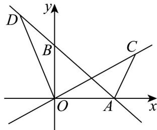
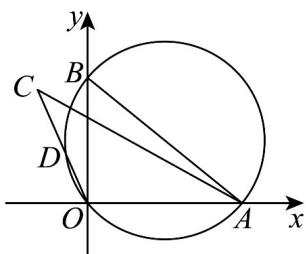

> [!faq]- 《高一数学下学期第一次月考（人教A版必修第二册第六章平面向量~第七章复数，高效培优·提升卷）》官方解析
>
> > [!success]- **【答案】** D
>
> > [!note]- **【解析】**
> > 设 $OA = a, OB = b, OC = c, OD = d$
> >
> > 因为 $c \cdot (c - a) = \frac{1}{2} |c||c - a|$
> >
> > 当 c = a 时，方程明显成立，
> >
> > 当 $c \neq a$ 时，即 $\left|c - a\right| = \left|\overline{A} C\right| \neq 0$
> >
> > 又 $OC \cdot AC = |OC||AC|\cos \angle OCA = \frac{1}{2} |OC||AC|,$
> >
> > 所以 $\cos\angle OCA=\frac{1}{2}$ ，又 $\angle OCA\in[0,\pi]$ ，所以 $\angle OCA=\frac{\pi}{3}$ ，
> >
> > 又 $d = \lambda a + (1 - \lambda)b (\lambda \in \mathbb{R})$ ，所以点 D 在直线 AB 上，
> >
> > 又 $c \cdot d = OC \cdot OD = 0$ ，所以 $OC \perp OD$ ，
> >
> > 即点 C 在与 OD 垂直的直线上，
> >
> > 当 $\lambda = 1$ ，即点 $D$ 在点 $A$ 处时，此时点 $C$ 在 $y$ 轴上（不含原点），无法满足，
> >
> > 
> >
> > 即命题①不正确；
> >
> > $$
> > \because (a - d) \cdot (b - d) = (\overline {{O A}} - \overline {{O D}}) \cdot (\overline {{O B}} - \overline {{O D}}) = \overline {{D A}} \cdot \overline {{D B}} = 0
> > $$
> >
> > ∴ $DA \perp DB$ ，即点 D 在以 AB 为直径的圆上，
> >
> > 又 $\left|c+d\right|=\left|c\right|+\left|d\right|$ ，所以 OC, OD 同向，
> >
> > 
> >
> > 所以当 $\angle AOD = \frac{2\pi}{3}$ 时， $\angle OCA < \frac{\pi}{3}$ ，此时不存在点 $C$ 使 $\angle OCA = \frac{\pi}{3}$
> >
> > 故命题②不正确；
> >
> > 故选：D.
> >
> > ## 二、选择题：本题共3小题，每小题6分，共18分．在每小题给出的选项中，有多项符合题目要求．全部选对的得6分，部分选对的得部分分，有选错的得0分.
