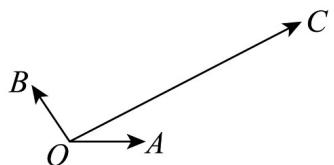

<!-- question-source:start -->
13．如图，平面内有三个向量 $OA, OB, OC$ ，其中 $OA$ 与 $OB$ 的夹角为 $120^{\circ}$ ， $OA$ 与 $OC$ 的夹角为 $30^{\circ}$ ，且

$\left|\overline{OA}\right| = \left|\overline{OB}\right| = 1$ ， $\left|\overline{OC}\right| = \sqrt{3}$ 若 $OC = \lambda \overline{OA} +\mu \overline{OB}$ ，则 $\lambda +\mu =$

<!-- question-source:end -->

![[高中/课堂同步/题库/人教A版高中数学同步讲义(2026)/02_必修第二册/月考/高一数学下学期第一次月考（人教A版必修第二册第六章平面向量~第七章复数，高效培优·提升卷）/三_填空题/questions/answers/Q00076793A1.md]]
