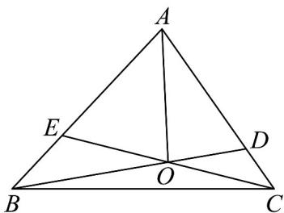

<!-- question-source:start -->
17. (15分)

如图，在 $\mathrm{V}ABC$ 中， $AE = 2EB$ ， $AD = 3DC$ ， $BD$ 与 $CE$ 交于 $O$ ，若 $AO = mAB + nAC$ ， $(m,m\in \mathbf{R})$

(1)求 $m + n$ 的值；

(2)设 $_{VABC}$ 的面积为S， $\triangle OBC$ 的面积为 $S'$ ，求 $\frac{S'}{S}$ 的值.
<!-- question-source:end -->

![[高中/课堂同步/题库/人教A版高中数学同步讲义(2026)/02_必修第二册/月考/高一数学下学期第一次月考（人教A版必修第二册第六章平面向量~第七章复数，高效培优·提升卷）/四_解答题/questions/answers/Q00076796A1.md]]
