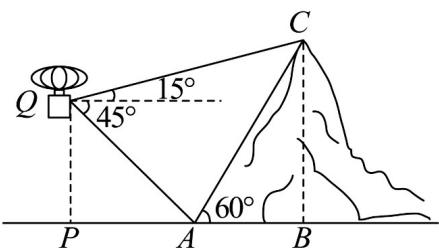

> [!faq]- 《高一数学下学期第三次月考卷（人教A版必修第二册第六章~第九章，高效培优）》官方解析
>
> > [!success]- **【答案】**  A. $100\mathrm{m}$ B. $200\mathrm{m}$ C. $300\mathrm{m}$ D. $200\sqrt{2}\mathrm{m}$
>
> > [!note]- **【解析】**
> > 由题意，在 Rt△ ABC 中，∠BAC = 60°，BC = 300，所以 $AC = \frac{BC}{\sin 60^{\circ}} = \frac{300}{\frac{\sqrt{3}}{2}} = 200\sqrt{3}$
> >
> > 在 $\triangle ACQ$ 中， $\angle AQC = 45^{\circ} + 15^{\circ} = 60^{\circ}$ ， $\angle QAC = 180^{\circ} - 45^{\circ} - 60^{\circ} = 75^{\circ}$
> >
> > 所以 $\angle ACQ = 180^{\circ} - 75^{\circ} - 60^{\circ} = 45^{\circ}$
> >
> > 由正弦定理， $\frac{AQ}{\sin45^{\circ}}=\frac{AC}{\sin60^{\circ}}\Rightarrow AQ=\frac{AC\cdot\sin45^{\circ}}{\sin60^{\circ}}=\frac{200\sqrt{3}\times\frac{\sqrt{2}}{2}}{\frac{\sqrt{3}}{2}}=200\sqrt{2}$
> >
> > 又 $\triangle APQ$ 为等腰直角三角形，所以 $PQ = AQ \cdot \sin 45^{\circ} = 200\sqrt{2} \times \frac{\sqrt{2}}{2} = 200$
> >
> > 故选项 B 正确.
> >
> > 5. 给出平面向量正交基底的概念：若平面向量的基底 $\left\{\begin{matrix}\mathrm{r} & \mathrm{r}\\ a, b\end{matrix}\right\}$ 满足 $a \perp b$ ，则称 $\left\{\begin{matrix}\mathrm{r} & \mathrm{r}\\ a, b\end{matrix}\right\}$ 为平面向量的正交基底。
> > 现在任取平面向量的一组基底 $\left\{\begin{matrix}\Box_{e_{1}},\Box_{e_{2}}\end{matrix}\right\}$ ，则下列选项中，一定能构成平面向量正交基底的是（）
> > A. $\left\{\begin{matrix}\vec{\Box},\vec{\Box},\vec{\Box},\vec{\Box},\vec{\Box},\vec{\Box}\\ e_{1},e_{1}+\frac{e_{1}\cdot e_{2}}{\left|e_{1}\right|^{2}}e_{2}\end{matrix}\right\}$ B. $\left\{\begin{matrix}\vec{\Box},\vec{\Box},\vec{\Box},\vec{\Box},\vec{\Box}\\ e_{1},e_{2}+\frac{e_{1}\cdot e_{2}}{\left|e_{1}\right|^{2}}e_{1}\end{matrix}\right\}$
> >
> > C. $\left\{e_1, e_1 - \frac{e_1 \cdot e_2}{|e_2|^2} e_2\right\}$ D. $\left\{e_1, e_2 - \frac{e_1 \cdot e_2}{|e_1|^2} e_1\right\}$
> >
> > 【答案】D
> >
> > 【详解】A选项 $\vec{e}_1\cdot \left(\vec{e}_1 + \frac{\vec{e}_1\cdot e_2}{\left|e_1\right|^2} e_2\right) = \left|\vec{e}_1\right|^2 +\frac{\left(e_1\cdot e_2\right)^2}{\left|e_1\right|^2}$ ，可考虑反例 $\vec{e}_1\perp \vec{e}_2$ ，此时该式 $= \left|e_1\right|^2\neq 0$ ，错误；B选项 $\vec{e}_1\cdot \left(\vec{e}_2 + \frac{\vec{e}_1\cdot e_2}{\left|e_1\right|^2} e_1\right) = e_1\cdot e_2 + \frac{\vec{e}_1\cdot e_2}{\left|e_1\right|^2} e_1\cdot e_1 = 2e_1\cdot e_2$
> >
> > 当 $e_1$ 不与 $e_2$ 垂直时，该结果就不等于0，错误；
> > C选项 $\vec{e}_1\cdot \left( \begin{array}{ccc}\vec{\square} & \vec{\square} & \vec{\square}\\ e_1 & -\frac{e_1\cdot e_2}{|e_2|^2} & e_2 \\ \end{array} \right) = \left|\vec{e}_1\right|^2 -\frac{\vec{\square}\vec{\square}}{\left|e_2\right|^2}$ ，可考虑反例 $\vec{e}_1\perp \vec{e}_2$ ，此时该式 $= \left|\vec{e}_1\right|^2\neq 0$ ，错误；
> > D选项 $\vec{e}_1\cdot \left( \begin{array}{ccc}\vec{\square} & \vec{\square} & \vec{\square}\\ e_2 & -\frac{e_1\cdot e_2}{|e_1|^2} & e_1 \\ \end{array} \right) = e_1\cdot e_2 - \frac{\vec{\square}\vec{\square}}{\left|e_1\right|^2} e_1\cdot e_1 = e_1\cdot e_2 - e_1\cdot e_2 = 0$ ，因此这两个向量垂直，正确.
