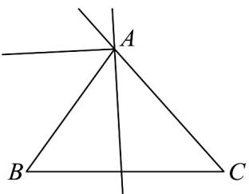

> [!faq]- 《高一数学下学期第三次月考卷（人教A版必修第二册第六章~第九章，高效培优）》官方解析
>
> > [!success]- **【答案】** A．在VABC中， $(BC+BA)\cdot AC=\left|AC\right|^{2}$ ，则VABC的形状一定是直角三角形 B．若 A, B, C, D 四点在同一条直线上，且 AB = CD，则 $AB = CD$ C．平行四边形ABCD中，若 $\left|AB+AD\right|=\left|AD-AB\right|$ ，则四边形ABCD是矩形 D．三个不共线的向量 $\underset{OA,OB,OC}{\overset{\underset{\longrightarrow}{\longrightarrow}}{\longrightarrow}}$ ，满足 $\overset{\underset{\longrightarrow}{\longrightarrow}}{OA}\cdot\left(\frac{\underset{\longrightarrow}{\longrightarrow}}{AB}+\frac{\underset{\longrightarrow}{\longrightarrow}}{CA}\right)=\overset{\underset{\longrightarrow}{\longrightarrow}}{OB}\cdot\left(\frac{\underset{\longrightarrow}{\longrightarrow}}{BA}+\frac{\underset{\longrightarrow}{\longrightarrow}}{CB}\right)=\overset{\underset{\longrightarrow}{\longrightarrow}}{OC}\cdot\left(\frac{\underset{\longrightarrow}{\longrightarrow}}{CA}+\frac{\underset{\longrightarrow}{\longrightarrow}}{BC}\right)=0$ 则 $O$ 是VABC的内心
>
> > [!note]- **【解析】**
> > 因为 $(BC+BA)\cdot AC=\left|AC\right|^{2}=AC^{2}$ ，所以 $(BC+BA-AC)\cdot AC=0$
> >
> > 得 $BA \cdot AC = 0$ ，则 $BA \perp AC$
> >
> > 故VABC的形状一定是直角三角形，故A正确；
> >
> > 由于四点的相对顺序不确定，故 B 错误；
> >
> > 因为 $\left|AB+AD\right|=\left|AD-AB\right|$ ，且 ABCD 是平行四边形，所以 $\left|AC\right|=\left|BD\right|$
> >
> > 所以四边形 ABCD 是矩形，故 C 正确；
> >
> > 因为 $\frac{\square\square\square}{|AB|} +\frac{\square\square\square}{|CA|}$ 与 中 的外角平分线平行，且 $\vec{OA}\cdot \left(\frac{\square\square\square\square}{|AB|} +\frac{\square\square\square\square}{|CA|}\right) = 0$
> >
> > 所以 $OA$ 是 $\angle A$ 的角平分线，
> >
> > 同理，OB 是 $\angle B$ 的角平分线，OC 是 $\angle C$ 的角平分线，
> >
> > 故 O 是 VABC 的内心，故 D 正确.
> >
> > 
