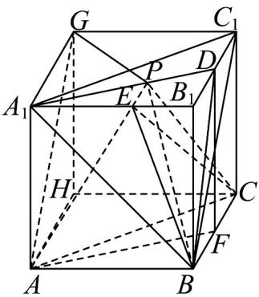
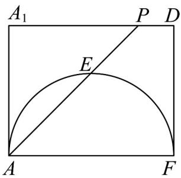

> [!faq]- 《高一数学下学期第三次月考卷（人教A版必修第二册第六章~第九章，高效培优）》官方解析
>
> > [!success]- **【答案】** A．四面体 $A-BC_{1}B_{1}$ 外接球的体积为 $\frac{20\sqrt{5}\pi}{3}$ B．若直线 PB 与底面 ABC 所成角为 $\theta$ ，则 $\cos\theta$ 取值范围为 $\left[\frac{\sqrt{21}}{7},\frac{\sqrt{3}}{2}\right]$ C．若 $A_{1}P=2$ ，则异面直线 AP 与 $BC_{1}$ 所成的角为 $\frac{\pi}{3}$ D．过 BC 且与 AP 垂直的截面 $\alpha$ 与 AP 交于点 E，则棱锥 P-BCE 体积最小值为 $\frac{3\sqrt{3}}{2}$
>
> > [!note]- **【解析】**
> > 
> >
> > 
> >
> > 对于 A，四面体 $A - BC_{1}B_{1}$ 外接球即为正三棱柱 $ABC - A_{1}B_{1}C_{1}$ 外接球，
> >
> > 因为VABC外接圆的半径 $r = \frac{\sqrt{3}}{3}\times 2\sqrt{3} = 2$ ，且 $\left|AA_1\right| = 2$
> >
> > 设正三棱柱 $ABC - A_{1}B_{1}C_{1}$ 外接球的半径为 $R$ ，设正三棱柱的高为 $h = \left|AA_{1}\right| = 2$
> >
> > 则由 $R^2 = \left(\frac{h}{2}\right)^2 + r^2$ 得 $R = \sqrt{5}$ ，故其体积为 $\frac{4}{3}\pi R^3 = \frac{20\sqrt{5}\pi}{3}$ ，A正确；
> >
> > 对于 B，取 BC 的中点 F，连接 DF，AF，BD， $A_{1}D$ ，
> >
> > 由正三棱柱的性质可知平面 $AA_{1}DF \perp$ 平面 ABC ，
> >
> > 所以当点 P 与 $A_{1}$ 重合时， $\theta$ 最小为 $\angle BAA_{1}$ ， $\sin\angle BAA_{1}=\frac{|AA_{1}|}{|A_{1}B|}=\frac{2}{4}=\frac{1}{2}$
> >
> > 当点与重合时，最大为 $\sin \angle DBF = \frac{|DF|}{|DB|} = \frac{2}{\sqrt{\left(\frac{2\sqrt{3}}{2}\right)^2 + 2^2}} = \frac{2\sqrt{7}}{7}$
> >
> > 所以 $\sin\theta\in\left[\frac{1}{2},\frac{2\sqrt{7}}{7}\right]$ ，易求得 $\cos\theta\in\left[\frac{\sqrt{21}}{7},\frac{\sqrt{3}}{2}\right]$ ，B 正确；
> >
> > 对于 C，将正三棱柱补成如图所示的直四棱柱，
> >
> > 则 $\angle GAP$ (或其补角)为异面直线 $AP$ 与 $BC_{1}$ 所成的角， $|AG| = |BC_{1}| = 4$ ， $|AP| = 2\sqrt{2}$
> >
> > 因为 $\angle GA_{1}C_{1} = 60^{\circ}$ ， $\angle C_1A_1D = 30^\circ$ ，所以 $\angle GA_{1}D = 90^{\circ}$ ，所以 $\left|GP\right| = \sqrt{\left(2\sqrt{3}\right)^2 + 2^2} = 4$
> >
> > 所以 $\cos\angle GAP=\frac{\sqrt{2}}{4}$ ，即 $\angle GAP\neq\frac{\pi}{3}$ ，C 错误；
> >
> > 对于D，因 $V_{P - ABC} = \frac{1}{3}\times 2\times \frac{\sqrt{3}}{4}\times \left(2\sqrt{3}\right)^2 = 2\sqrt{3}$
> >
> > 故要使三棱锥 P-BCE 的体积最小，则三棱锥 E-ABC 的体积最大，
> >
> > 设 BC 的中点为 F ，作出截面如图所示，
> >
> > 因为 $AP \perp \alpha$ ，所以 $AP \perp EF$ ，所以点 E 在以 AF 为直径的圆上，
> >
> > 所以点 $E$ 到底面 $ABC$ 距离的最大值为 $\frac{1}{2}|AF| = \frac{1}{2} \times \left( \frac{\sqrt{3}}{2} \times 2\sqrt{3} \right) = \frac{3}{2}$
> >
> > 所以三棱锥 P-BCE 的体积的最小值为 $2\sqrt{3}-\frac{1}{3}\times\frac{3}{2}\times\frac{\sqrt{3}}{4}\times\left(2\sqrt{3}\right)^{2}=\frac{\sqrt{3}}{2}$ ，D 错误.
