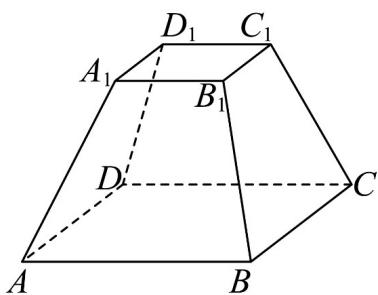

<!-- question-source:start -->
16.（15分）为了响应全国文明城市的号召，长沙市计划在公园内建造如图所示的正四棱台

$ABCD-A_{1}B_{1}C_{1}D_{1}$ 建筑.

(1)若正四棱台的上、下底面的边长分别为6米和10米，高8米.求该正四棱台 $ABCD-A_{1}B_{1}C_{1}D_{1}$ 的体积；

(2)求该正四棱台 $ABCD - A_{1}B_{1}C_{1}D_{1}$ 的侧面积；
<!-- question-source:end -->

![[高中/课堂同步/题库/人教A版高中数学同步讲义(2026)/02_必修第二册/月考/高一数学下学期第三次月考卷（人教A版必修第二册第六章~第九章，高效培优）/三_填空题/questions/answers/Q00076811A1.md]]
