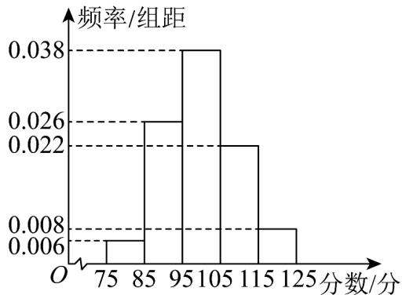

<!-- question-source:start -->
17. （15分）某市为提高市民对文明城市创建的认识，举办了“创建文明城市”知识竞赛，从所有答卷中随

机抽取100份作为样本，将样本的成绩分成 $[75,85)$ ， $[85,95)$ ， $[95,105)$ ， $[105,115)$ ， $[115,125]$ 这五组，得

到如图所示的频率分布直方图.

(1)估计样本成绩的平均数及方差；（同一组中的数据用该组区间的中点值作为代表）

(2)已知落在 $[75,85)$ 内的平均成绩是80分，方差是4分，落在 $[85,95)$ 内的平均成绩是88分，方差是6分，

求两组成绩合并后的平均数 $\overline{z}$ 和方差 $s^{2}$

附：设两组数据的样本量、样本平均数和样本方差分别为 $m$ ， $\overline{x}_1$ ， $s_1^2$ ； $n$ ， $\overline{x}_2$ ， $s_2^2$ ，记两组数据总体的样

本平均数为 $\overline{w}$ ，则总体样本方差 $s^2 = \frac{m}{m + n}\left[s_1^2 + (\overline{x_1} - \overline{w})^2\right] + \frac{n}{m + n}\left[s_2^2 + (\overline{x_2} - \overline{w})^2\right]$ .
<!-- question-source:end -->

![[高中/课堂同步/题库/人教A版高中数学同步讲义(2026)/02_必修第二册/月考/高一数学下学期第三次月考卷（人教A版必修第二册第六章~第九章，高效培优）/三_填空题/questions/answers/Q00076812A1.md]]
