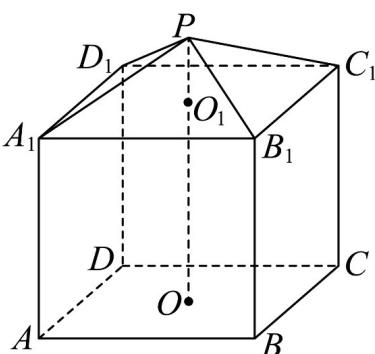

<!-- question-source:start -->
19．（17分）现有一几何体由上，下两部分组成，上部是正四棱锥 $P-A_{1}B_{1}C_{1}D_{1}$ 下部是正四棱柱 $ABCD-A_{1}B_{1}C_{1}D_{1}$ (如图所示)，且正四棱柱的高 $O_{1}O$ 是正四棱锥的高 $PO_{1}$ 的3倍.

(1)若 $AB = 6, PO_{1} = 2$ 求该几何体的体积与表面积.

(2)若正四棱锥的侧棱长为6， $PO_{1}=2$ 且Q，N分别是线段 $A_{1}B_{1},PB_{1}$ 上的动点，求 $AQ+QN$ 的最小值.
<!-- question-source:end -->

![[高中/课堂同步/题库/人教A版高中数学同步讲义(2026)/02_必修第二册/月考/高一数学下学期第三次月考卷（人教A版必修第二册第六章~第九章，高效培优）/三_填空题/questions/answers/Q00076814A1.md]]
