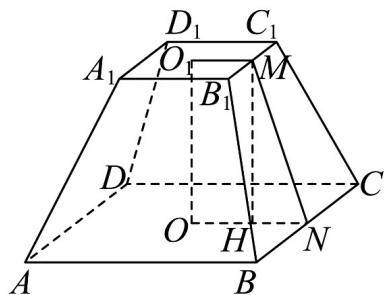

> [!faq]- 《高一数学下学期第三次月考卷（人教A版必修第二册第六章~第九章，高效培优）》官方解析
>
> > [!success]- **【答案】** (1) $\frac{1568}{3}\left(m^{3}\right)$ (2) $64\sqrt{17}\left(m^{2}\right)$
>
> > [!note]- **【解析】**
> > （1）因为正四棱台的上、下底面的边长分别为6和10，高为8，
> >
> > 故正四棱台 $ABCD-A_{1}B_{1}C_{1}D_{1}$ 体积为 $V=\frac{1}{3}\times\left(6^{2}+10^{2}+\sqrt{6^{2}\times10^{2}}\right)\times8=\frac{1568}{3}\left(\mathrm{m}^{3}\right)$
> >
> > (2) 记 $O_{1}$ , $O$ 分别为棱台上、下底面的中心, 分别取 $B_{1}C_{1}$ , $BC$ 的中点 $M$ , $N$ ,
> >
> > 连接 $OO_{1}$ ， $O_{1}M$ ，ON，MN，在梯形 $O_{1}MNO$ 中，过M作 $MH\perp ON$ 于H
> >
> > 由于正四棱台侧面是全等的等腰梯形，且 $O_{1}O = MH = 8$ ， $O_{1}M = 3$ ， $ON = 5$
> >
> > 所以 $HN = 2$ ，所以 $MN = \sqrt{MH^2 + HN^2} = \sqrt{8^2 + 2^2} = 2\sqrt{17}$
> >
> > 故该正四棱台的侧面积为 $S = 4 \times \frac{1}{2} \times (6 + 10) \times 2\sqrt{17} = 64\sqrt{17}\left(\mathrm{m}^{2}\right)$ .
> >
> > 
