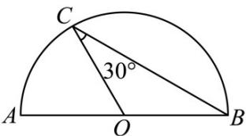
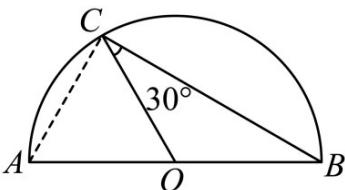

> [!faq]- 《专题01_平面向量的基本概念_高效培优期中专项训练_数学人教A版高一必》官方解析
>
> > [!success]- **【答案】**  A. 1 B. $\sqrt{2}$ C. $\sqrt{3}$ D. 2
>
> > [!note]- **【解析】**
> > 如图，连接AC，
> >
> > 由 $\left|\overline{OC}\right|=\left|\overline{OB}\right|$ ，得 $\angle ABC=\angle OCB=30^{\circ}$
> >
> > 因为 C 为半圆上的点，所以 $\angle ACB = 90^{\circ}$ ，
> >
> > 所以 $\left| \overline{AC} \right| = \frac{1}{2} \left| AB \right| = 1$
> >
> > 
> >
> > 故选 **A**.
