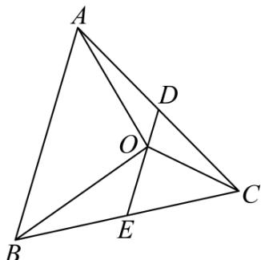

> [!faq]- 《专题01_平面向量的基本概念_高效培优期中专项训练_数学人教A版高一必》官方解析
>
> > [!success]- **【答案】** A. 若 $a // b, b // c$ ，则 $a // c$ B．若 $2\overline{OA} +\overline{OB} +3\overline{OC} = 0$ ， $S_{\Delta AOC}$ ， $S_{\Delta ABC}$ 分别表示 $\Delta AOC$ ， $\Delta ABC$ 的面积，则 $S_{\Delta AOC}:S_{\Delta ABC} = 1:6$ C．两个非零向量 $a$ ， $b$ ，若 $\left|a - b\right| = \left|a\right| + \left|b\right|$ ，则 $a$ 与 $b$ 共线且反向 D．若 $a / / b$ ，则存在唯一实数 $\lambda$ 使得 $a = \lambda b$
>
> > [!note]- **【解析】**
> > A. 若 $a // b, b // c$ ，则 $a // c$ ，如果 $a$ ， $c$ 都是非零向量， $b = 0$ ，显然满足已知条件，但是结论不一定成立，所以该选项是错误的；
> >
> > B. 如图，D,E 分别是 AC,BC 的中点，
> >
> > 
> >
> > $$
> > 2 O A + O B + 3 O C = 0, \therefore 2 (O A + O C) + (O B + O C) = 0, \therefore 4 O D + 2 O E = 0, \therefore O E = - 2 O D
> > $$
> >
> > 所以 $OD = \frac{1}{6} AB,$ 则 $S_{\Delta AOC}: S_{\Delta ABC} = 1:6$ ，所以该选项是正确的；
> >
> > C. 两个非零向量 $a$ ， $b$ ，若 $|a - b| = |a| + |b|$ ，则 $a$ 与 $b$ 共线且反向，所以该选项是正确的；
> >
> > D. 若 $a // b$ ，如果 $a$ 是非零向量， $b = 0$ ，则不存在实数 $\lambda$ 使得 $a = \lambda b$ ，所以该选项是错误的。
> >
> > 故选 **A**,D
